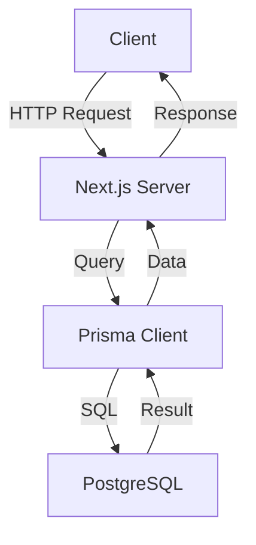

# Documentation Instructions

Documentation Structure

StormCom uses **Spec-Driven Development** with documentation organized across `docs/` and feature-specific specs under `specs/`:

```
specs/
└── 001-multi-tenant-ecommerce/
  ├── spec.md           # Feature specification
  ├── plan.md           # Implementation plan
  ├── data-model.md     # Database schema
  ├── quickstart.md     # Local setup guide
  ├── tasks.md          # Task breakdown
  └── contracts/
    └── openapi.yaml  # API documentation

docs/
├── analysis/                  # Analysis documents
│   └── ecommerce_complete_srs.md
├── audit/                     # UI audit HTML snapshots
└── references/                # Legacy documentation

.specify/
└── memory/
  └── constitution.md       # Project standards and requirements
```

## Markdown Standards

### Headers

Use ATX-style headers with proper hierarchy:

```markdown
# H1 - Document Title (one per file)

## H2 - Main Section

### H3 - Subsection

#### H4 - Minor Section
```

### Lists

**Unordered lists** - Use hyphens consistently:

```markdown
- First item
- Second item
  - Nested item
  - Another nested item
- Third item
```

**Ordered lists** - Use numbers:

```markdown
1. First step
2. Second step
3. Third step
```

### Code Blocks

**Always specify language** for syntax highlighting:

````markdown
```typescript
interface Product {
  id: string;
  name: string;
}
```

```bash
npm install
npm run dev
```
````

### Links

**Internal links** - Use relative paths:

```markdown
See [Project Constitution](../../.specify/memory/constitution.md)
See [Implementation Plan](../../specs/001-multi-tenant-ecommerce/plan.md)
```

**External links**:

```markdown
Visit [Next.js Documentation](https://nextjs.org/docs)
```

### Tables

Use proper alignment:

```markdown
| Feature | Status | Priority |
|---------|--------|----------|
| Products | ✅ Complete | P1 |
| Orders | 🚧 In Progress | P1 |
| Analytics | 📋 Planned | P2 |
```

### Emphasis

- **Bold** for important terms: `**important**`
- *Italic* for emphasis: `*emphasis*`
- `Code` for technical terms: `` `code` ``

## File Naming

- Use lowercase with hyphens: `implementation-plan.md`
- Be descriptive: `database-schema.md` not `db.md`
- README files: `README.md` (capitalized)

## Documentation Types

### README Files

**Root README** should include:
- Project overview
- Tech stack
- Quick start guide
- Development commands
- Links to detailed documentation

**Feature README** should include:
- Feature description
- Usage examples
- Configuration options
- Troubleshooting

### Specification Documents

Follow the Spec-Driven Development format:

```markdown
# Feature Specification: [Feature Name]

**Status**: Active Development | Complete | Deprecated
**Created**: YYYY-MM-DD
**Updated**: YYYY-MM-DD

## Executive Summary

Brief overview of the feature.

## Requirements

### Functional Requirements

1. **FR-001**: Description
2. **FR-002**: Description

### Non-Functional Requirements

1. **NFR-001**: Performance requirement
2. **NFR-002**: Security requirement

## User Stories

**US-001: [Title]**
As a [role], I want [goal] so that [benefit].

**Acceptance Criteria:**
- [ ] Criterion 1
- [ ] Criterion 2

## Technical Design

### Architecture
### Data Model
### API Endpoints

## Implementation Plan

### Phase 1: [Name]
- Task 1
- Task 2

## Testing Strategy

## Deployment Plan

## Risks & Mitigations
```

### API Documentation

Document all API endpoints:

```markdown
## API Endpoints

### Products

#### List Products

**Endpoint**: `GET /api/products`

**Query Parameters**:
- `page` (number, optional): Page number (default: 1)
- `perPage` (number, optional): Items per page (default: 10, max: 100)
- `search` (string, optional): Search term

**Response**:
```json
{
  "data": [
    {
      "id": "prod_123",
      "name": "Product Name",
      "price": 29.99
    }
  ],
  "meta": {
    "page": 1,
    "perPage": 10,
    "total": 100,
    "totalPages": 10
  }
}
```

**Status Codes**:
- `200 OK`: Success
- `401 Unauthorized`: Not authenticated
- `500 Internal Server Error`: Server error

#### Create Product

**Endpoint**: `POST /api/products`

**Request Body**:
```json
{
  "name": "Product Name",
  "price": 29.99,
  "description": "Product description"
}
```

**Response**: Same as List Products
```

### Database Schema Documentation

Document all database tables:

```markdown
## Database Schema

### Products Table

**Table Name**: `products`

**Columns**:

| Column | Type | Constraints | Description |
|--------|------|-------------|-------------|
| id | String | PRIMARY KEY, CUID | Unique identifier |
| storeId | String | FOREIGN KEY, INDEX | Store reference |
| name | String | NOT NULL | Product name |
| price | Decimal(10,2) | NOT NULL | Product price |
| description | Text | NULLABLE | Product description |
| createdAt | DateTime | NOT NULL, DEFAULT NOW() | Creation timestamp |
| updatedAt | DateTime | NOT NULL, AUTO UPDATE | Last update timestamp |
| deletedAt | DateTime | NULLABLE | Soft delete timestamp |

**Indexes**:
- `idx_products_store_id` on `storeId`
- `idx_products_store_created` on `(storeId, createdAt)`

**Unique Constraints**:
- `uq_products_store_sku` on `(storeId, sku)`

**Relations**:
- Belongs to `Store` via `storeId`
- Has many `OrderItems`
- Has many `ProductVariants`
```

## Code Documentation

### JSDoc Comments

For complex functions and types:

```typescript
/**
 * Calculates the discounted price for a product
 * 
 * @param originalPrice - The original product price
 * @param discountPercent - The discount percentage (0-100)
 * @returns The discounted price rounded to 2 decimal places
 * @throws {Error} If discount percent is invalid
 * 
 * @example
 * ```typescript
 * calculateDiscount(100, 20); // Returns 80
 * ```
 */
export function calculateDiscount(originalPrice: number, discountPercent: number): number {
  if (discountPercent < 0 || discountPercent > 100) {
    throw new Error('Discount percent must be between 0 and 100');
  }
  return Math.round((originalPrice * (1 - discountPercent / 100)) * 100) / 100;
}
```

### Inline Comments

Use sparingly, only for complex logic:

```typescript
// Calculate tax based on store location
// Note: Tax rates vary by state and are cached for 24 hours
const taxRate = await getTaxRate(store.state);
const tax = subtotal * taxRate;
```

## Changelog

Maintain a CHANGELOG.md file following [Keep a Changelog](https://keepachangelog.com/):

```markdown
# Changelog

All notable changes to this project will be documented in this file.

## [Unreleased]

### Added
- Feature XYZ

### Changed
- Updated dependency X to v2.0

### Fixed
- Bug ABC

## [1.0.0] - 2025-01-15

### Added
- Initial release
- Product management
- Order processing
```

## Documentation Best Practices

### Writing Style

1. **Be clear and concise**: Avoid jargon, use simple language
2. **Use active voice**: "Click the button" not "The button should be clicked"
3. **Be specific**: Include exact commands, file paths, values
4. **Provide examples**: Show don't just tell
5. **Keep it updated**: Update docs when code changes

### Structure

1. **Start with overview**: High-level summary first
2. **Use progressive disclosure**: Simple to complex
3. **Group related content**: Logical sections
4. **Include table of contents**: For long documents
5. **Add navigation links**: Link to related docs

### Code Examples

1. **Complete examples**: Show full working code
2. **Syntax highlighting**: Always specify language
3. **Context**: Explain what the code does
4. **Real-world scenarios**: Use practical examples
5. **Test examples**: Ensure they work

### Diagrams

Use Mermaid for diagrams when possible:

````markdown

````

## Documentation Maintenance

### When to Update Documentation

Update documentation when:
- Adding new features
- Changing existing behavior
- Fixing bugs that affect documented behavior
- Deprecating features
- Updating dependencies with breaking changes
- Changing configuration or environment setup

### Documentation Review Checklist

Before committing documentation changes:

- [ ] Spelling and grammar checked
- [ ] All links work (internal and external)
- [ ] Code examples tested and working
- [ ] Screenshots are current and clear
- [ ] Follows project documentation standards
- [ ] Table of contents updated (if applicable)
- [ ] Version/date information updated
- [ ] Cross-references to related docs added

## Templates

### Feature Request Template

```markdown
# Feature Request: [Feature Name]

## Problem Statement
Describe the problem or need this feature addresses.

## Proposed Solution
Describe your proposed solution.

## Alternatives Considered
What other solutions did you consider?

## User Stories
- As a [role], I want [goal] so that [benefit]

## Acceptance Criteria
- [ ] Criterion 1
- [ ] Criterion 2

## Technical Considerations
- Performance impact
- Security considerations
- Dependencies

## Priority
- [ ] Critical
- [ ] High
- [ ] Medium
- [ ] Low
```

### Bug Report Template

```markdown
# Bug Report: [Short Description]

## Description
Clear description of the bug.

## Steps to Reproduce
1. Step 1
2. Step 2
3. Step 3

## Expected Behavior
What should happen.

## Actual Behavior
What actually happens.

## Environment
- OS: [e.g., macOS 13.0]
- Browser: [e.g., Chrome 120]
- Node.js: [e.g., 18.17.0]
- Next.js: [e.g., 15.5.5]

## Screenshots
If applicable, add screenshots.

## Additional Context
Any other relevant information.
```

## References

- [Markdown Guide](https://www.markdownguide.org/)
- [GitHub Flavored Markdown](https://github.github.com/gfm/)
- [Conventional Commits](https://www.conventionalcommits.org/)
- [Keep a Changelog](https://keepachangelog.com/)
- [Semantic Versioning](https://semver.org/)
