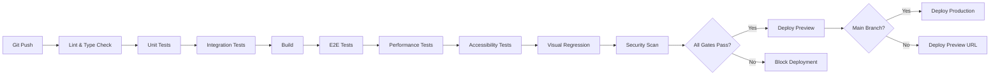

# CI/CD Configuration & Quality Gates

## Overview

This document defines the continuous integration and deployment (CI/CD) pipeline for StormCom's multi-tenant e-commerce platform. The pipeline enforces quality gates at every stage, ensuring code quality, performance, accessibility, and security before deployment.

**Success Criteria:**
- **SC-010**: Security audit passing (Dependabot, CodeQL, secret scanning)
- **SC-024**: 80% minimum test coverage enforced in CI
- **SC-027**: Lighthouse CI performance budgets enforced (LCP < 2s, CLS < 0.1, TBT < 300ms)
- **SC-031**: WCAG 2.1 Level AA accessibility standards validated in CI

**Related Documents:**
- Testing Strategy: `docs/testing-strategy.md`
- Design System: `docs/design-system.md`
- Webhook Standards: `docs/webhook-standards.md`

---

## Table of Contents

1. [Pipeline Overview](#pipeline-overview)
2. [GitHub Actions Workflows](#github-actions-workflows)
3. [Quality Gates](#quality-gates)
4. [Performance Budgets](#performance-budgets)
5. [Accessibility Validation](#accessibility-validation)
6. [Visual Regression Testing](#visual-regression-testing)
7. [Security Scanning](#security-scanning)
8. [Deployment Strategy](#deployment-strategy)
9. [Monitoring & Observability](#monitoring--observability)
10. [Configuration Files](#configuration-files)

---

## Pipeline Overview

### CI/CD Stages



### Quality Gates Checklist

Before deployment, ALL of the following must pass:

- ✅ **Linting**: ESLint with no errors (warnings allowed)
- ✅ **Type Checking**: TypeScript strict mode with no errors
- ✅ **Unit Tests**: 80% coverage minimum, all tests passing
- ✅ **Integration Tests**: All database/API tests passing
- ✅ **Build**: Next.js build succeeds, bundle size < 200KB (fail), < 180KB (warn)
- ✅ **E2E Tests**: Critical user paths (auth, checkout, orders) passing
- ✅ **Performance**: Lighthouse CI budgets met (LCP < 2s, CLS < 0.1, TBT < 300ms)
- ✅ **Accessibility**: axe-core WCAG 2.1 Level AA with 0 violations
- ✅ **Visual Regression**: Percy approval or auto-approved if < 0.1% difference
- ✅ **Security**: Dependabot, CodeQL, secret scanning with no critical issues

---

## GitHub Actions Workflows

### Main CI Workflow

**.github/workflows/ci.yml**

```yaml
name: CI Pipeline

on:
  push:
    branches: [main, develop]
  pull_request:
    branches: [main, develop]

concurrency:
  group: ${{ github.workflow }}-${{ github.ref }}
  cancel-in-progress: true

env:
  NODE_VERSION: '18'
  DATABASE_URL: 'file:./test.db' # SQLite for tests

jobs:
  lint:
    name: Lint & Type Check
    runs-on: ubuntu-latest
    
    steps:
      - uses: actions/checkout@v4
      
      - name: Setup Node.js
        uses: actions/setup-node@v4
        with:
          node-version: ${{ env.NODE_VERSION }}
          cache: 'npm'
      
      - name: Install dependencies
        run: npm ci
      
      - name: Run ESLint
        run: npm run lint
      
      - name: Run TypeScript type check
        run: npm run type-check

  unit-tests:
    name: Unit Tests
    runs-on: ubuntu-latest
    needs: lint
    
    steps:
      - uses: actions/checkout@v4
      
      - name: Setup Node.js
        uses: actions/setup-node@v4
        with:
          node-version: ${{ env.NODE_VERSION }}
          cache: 'npm'
      
      - name: Install dependencies
        run: npm ci
      
      - name: Run unit tests with coverage
        run: npm run test:coverage
      
      - name: Check coverage thresholds
        run: |
          COVERAGE=$(cat coverage/coverage-summary.json | jq '.total.lines.pct')
          if (( $(echo "$COVERAGE < 80" | bc -l) )); then
            echo "Coverage $COVERAGE% is below 80% threshold"
            exit 1
          fi
      
      - name: Upload coverage to Codecov
        uses: codecov/codecov-action@v3
        with:
          files: ./coverage/coverage-final.json
          flags: unittests

  integration-tests:
    name: Integration Tests
    runs-on: ubuntu-latest
    needs: lint
    
    steps:
      - uses: actions/checkout@v4
      
      - name: Setup Node.js
        uses: actions/setup-node@v4
        with:
          node-version: ${{ env.NODE_VERSION }}
          cache: 'npm'
      
      - name: Install dependencies
        run: npm ci
      
      - name: Generate Prisma Client
        run: npx prisma generate
      
      - name: Run integration tests
        run: npm run test:integration
        env:
          DATABASE_URL: 'file:./test-integration.db'

  build:
    name: Build & Bundle Analysis
    runs-on: ubuntu-latest
    needs: [unit-tests, integration-tests]
    
    steps:
      - uses: actions/checkout@v4
      
      - name: Setup Node.js
        uses: actions/setup-node@v4
        with:
          node-version: ${{ env.NODE_VERSION }}
          cache: 'npm'
      
      - name: Install dependencies
        run: npm ci
      
      - name: Generate Prisma Client
        run: npx prisma generate
      
      - name: Build Next.js
        run: npm run build
        env:
          SKIP_ENV_VALIDATION: true
      
      - name: Analyze bundle size
        uses: actions/github-script@v7
        with:
          script: |
            const fs = require('fs');
            const path = require('path');
            
            // Read Next.js build manifest
            const manifestPath = path.join(process.cwd(), '.next/build-manifest.json');
            const manifest = JSON.parse(fs.readFileSync(manifestPath, 'utf8'));
            
            // Calculate total bundle size
            let totalSize = 0;
            for (const page in manifest.pages) {
              const files = manifest.pages[page];
              for (const file of files) {
                const filePath = path.join(process.cwd(), '.next', file);
                if (fs.existsSync(filePath)) {
                  totalSize += fs.statSync(filePath).size;
                }
              }
            }
            
            const sizeKB = Math.round(totalSize / 1024);
            console.log(`Total bundle size: ${sizeKB} KB`);
            
            // Check thresholds
            if (sizeKB > 200) {
              core.setFailed(`Bundle size ${sizeKB} KB exceeds 200 KB limit`);
            } else if (sizeKB > 180) {
              core.warning(`Bundle size ${sizeKB} KB exceeds 180 KB warning threshold`);
            } else {
              core.info(`✅ Bundle size ${sizeKB} KB is within limits`);
            }
      
      - name: Upload build artifacts
        uses: actions/upload-artifact@v4
        with:
          name: build-output
          path: .next
          retention-days: 7

  e2e-tests:
    name: E2E Tests (Playwright)
    runs-on: ubuntu-latest
    needs: build
    
    steps:
      - uses: actions/checkout@v4
      
      - name: Setup Node.js
        uses: actions/setup-node@v4
        with:
          node-version: ${{ env.NODE_VERSION }}
          cache: 'npm'
      
      - name: Install dependencies
        run: npm ci
      
      - name: Install Playwright browsers
        run: npx playwright install --with-deps chromium firefox webkit
      
      - name: Download build artifacts
        uses: actions/download-artifact@v4
        with:
          name: build-output
          path: .next
      
      - name: Generate Prisma Client
        run: npx prisma generate
      
      - name: Seed test database
        run: npm run db:seed:test
        env:
          DATABASE_URL: 'file:./test-e2e.db'
      
      - name: Run E2E tests
        run: npm run test:e2e
        env:
          DATABASE_URL: 'file:./test-e2e.db'
          BASE_URL: 'http://localhost:3000'
      
      - name: Upload Playwright report
        if: always()
        uses: actions/upload-artifact@v4
        with:
          name: playwright-report
          path: playwright-report/
          retention-days: 30

  performance-tests:
    name: Performance Tests (Lighthouse CI)
    runs-on: ubuntu-latest
    needs: build
    
    steps:
      - uses: actions/checkout@v4
      
      - name: Setup Node.js
        uses: actions/setup-node@v4
        with:
          node-version: ${{ env.NODE_VERSION }}
          cache: 'npm'
      
      - name: Install dependencies
        run: npm ci
      
      - name: Download build artifacts
        uses: actions/download-artifact@v4
        with:
          name: build-output
          path: .next
      
      - name: Generate Prisma Client
        run: npx prisma generate
      
      - name: Start Next.js server
        run: npm run start &
        env:
          DATABASE_URL: 'file:./test-lighthouse.db'
          PORT: 3000
      
      - name: Wait for server
        run: npx wait-on http://localhost:3000
      
      - name: Run Lighthouse CI
        run: npx @lhci/cli@0.14.x autorun
        env:
          LHCI_GITHUB_APP_TOKEN: ${{ secrets.LHCI_GITHUB_APP_TOKEN }}
      
      - name: Upload Lighthouse results
        uses: actions/upload-artifact@v4
        with:
          name: lighthouse-results
          path: .lighthouseci/
          retention-days: 30

  accessibility-tests:
    name: Accessibility Tests (axe-core)
    runs-on: ubuntu-latest
    needs: build
    
    steps:
      - uses: actions/checkout@v4
      
      - name: Setup Node.js
        uses: actions/setup-node@v4
        with:
          node-version: ${{ env.NODE_VERSION }}
          cache: 'npm'
      
      - name: Install dependencies
        run: npm ci
      
      - name: Install Playwright
        run: npx playwright install --with-deps chromium
      
      - name: Download build artifacts
        uses: actions/download-artifact@v4
        with:
          name: build-output
          path: .next
      
      - name: Generate Prisma Client
        run: npx prisma generate
      
      - name: Start Next.js server
        run: npm run start &
        env:
          DATABASE_URL: 'file:./test-a11y.db'
          PORT: 3000
      
      - name: Wait for server
        run: npx wait-on http://localhost:3000
      
      - name: Run accessibility tests
        run: npm run test:a11y
      
      - name: Upload accessibility report
        if: always()
        uses: actions/upload-artifact@v4
        with:
          name: accessibility-report
          path: a11y-report/
          retention-days: 30

  visual-regression:
    name: Visual Regression (Percy)
    runs-on: ubuntu-latest
    needs: build
    if: github.event_name == 'pull_request'
    
    steps:
      - uses: actions/checkout@v4
      
      - name: Setup Node.js
        uses: actions/setup-node@v4
        with:
          node-version: ${{ env.NODE_VERSION }}
          cache: 'npm'
      
      - name: Install dependencies
        run: npm ci
      
      - name: Install Playwright
        run: npx playwright install --with-deps chromium
      
      - name: Download build artifacts
        uses: actions/download-artifact@v4
        with:
          name: build-output
          path: .next
      
      - name: Generate Prisma Client
        run: npx prisma generate
      
      - name: Start Next.js server
        run: npm run start &
        env:
          DATABASE_URL: 'file:./test-visual.db'
          PORT: 3000
      
      - name: Wait for server
        run: npx wait-on http://localhost:3000
      
      - name: Run Percy visual tests
        run: npx percy exec -- npm run test:visual
        env:
          PERCY_TOKEN: ${{ secrets.PERCY_TOKEN }}

  security-scan:
    name: Security Scan
    runs-on: ubuntu-latest
    needs: lint
    
    steps:
      - uses: actions/checkout@v4
      
      - name: Run npm audit
        run: npm audit --audit-level=moderate
        continue-on-error: true
      
      - name: Run Snyk security scan
        uses: snyk/actions/node@master
        env:
          SNYK_TOKEN: ${{ secrets.SNYK_TOKEN }}
        with:
          args: --severity-threshold=high
      
      - name: Upload Snyk results to GitHub Security
        uses: github/codeql-action/upload-sarif@v3
        with:
          sarif_file: snyk.sarif

  deploy-preview:
    name: Deploy Preview (Vercel)
    runs-on: ubuntu-latest
    needs: [e2e-tests, performance-tests, accessibility-tests, security-scan]
    if: github.event_name == 'pull_request'
    
    steps:
      - uses: actions/checkout@v4
      
      - name: Deploy to Vercel Preview
        uses: amondnet/vercel-action@v25
        with:
          vercel-token: ${{ secrets.VERCEL_TOKEN }}
          vercel-org-id: ${{ secrets.VERCEL_ORG_ID }}
          vercel-project-id: ${{ secrets.VERCEL_PROJECT_ID }}
          scope: ${{ secrets.VERCEL_ORG_ID }}
      
      - name: Comment PR with preview URL
        uses: actions/github-script@v7
        with:
          script: |
            github.rest.issues.createComment({
              issue_number: context.issue.number,
              owner: context.repo.owner,
              repo: context.repo.repo,
              body: `✅ Preview deployment ready!\n\n🔗 Preview URL: ${{ steps.deploy.outputs.preview-url }}`
            })

  deploy-production:
    name: Deploy Production (Vercel)
    runs-on: ubuntu-latest
    needs: [e2e-tests, performance-tests, accessibility-tests, security-scan, visual-regression]
    if: github.ref == 'refs/heads/main' && github.event_name == 'push'
    
    steps:
      - uses: actions/checkout@v4
      
      - name: Deploy to Vercel Production
        uses: amondnet/vercel-action@v25
        with:
          vercel-token: ${{ secrets.VERCEL_TOKEN }}
          vercel-org-id: ${{ secrets.VERCEL_ORG_ID }}
          vercel-project-id: ${{ secrets.VERCEL_PROJECT_ID }}
          vercel-args: '--prod'
          scope: ${{ secrets.VERCEL_ORG_ID }}
```

---

## Quality Gates

### 1. Linting & Type Checking

**Tools**: ESLint 9.x, TypeScript 5.9+

**Configuration**: `eslint.config.mjs`

```javascript
// eslint.config.mjs
import { FlatCompat } from '@eslint/eslintrc';
import js from '@eslint/js';
import typescriptPlugin from '@typescript-eslint/eslint-plugin';
import typescriptParser from '@typescript-eslint/parser';

const compat = new FlatCompat({
  baseDirectory: import.meta.dirname,
  recommendedConfig: js.configs.recommended,
});

export default [
  {
    files: ['**/*.ts', '**/*.tsx'],
    languageOptions: {
      parser: typescriptParser,
      parserOptions: {
        ecmaVersion: 'latest',
        sourceType: 'module',
        project: './tsconfig.json',
      },
    },
    plugins: {
      '@typescript-eslint': typescriptPlugin,
    },
    rules: {
      '@typescript-eslint/no-unused-vars': ['error', { argsIgnorePattern: '^_' }],
      '@typescript-eslint/no-explicit-any': 'warn',
      '@typescript-eslint/explicit-function-return-type': ['warn', {
        allowExpressions: true,
        allowTypedFunctionExpressions: true,
      }],
      'no-console': ['warn', { allow: ['warn', 'error'] }],
    },
  },
  ...compat.extends('next/core-web-vitals'),
];
```

**CI Command**:
```bash
npm run lint           # Check for errors
npm run lint -- --fix  # Auto-fix issues
npm run type-check     # TypeScript strict mode
```

**Blocking Criteria**:
- ❌ Any ESLint errors
- ❌ Any TypeScript type errors
- ⚠️ Warnings allowed (but tracked)

---

### 2. Unit & Integration Tests

**Tools**: Vitest 3.2.4, Testing Library, Prisma

**Coverage Thresholds**: 80% global (90% services, 100% utils)

**CI Command**:
```bash
npm run test:coverage      # Run tests with coverage
npm run test:integration   # Run integration tests
```

**Blocking Criteria**:
- ❌ Any test failures
- ❌ Coverage < 80% global
- ❌ Coverage < 90% in `src/services/`
- ❌ Coverage < 100% in `src/lib/utils/`

**Coverage Report**: Uploaded to Codecov for PR comments

---

### 3. Build & Bundle Size

**Tools**: Next.js 15, webpack-bundle-analyzer

**Bundle Size Limits**:
- ⚠️ **Warning**: 180 KB total initial JS
- ❌ **Error**: 200 KB total initial JS

**CI Command**:
```bash
npm run build                    # Build Next.js
npm run analyze                  # Generate bundle report
```

**Blocking Criteria**:
- ❌ Build fails
- ❌ Bundle size > 200 KB
- ⚠️ Bundle size > 180 KB (warning only)

---

### 4. E2E Tests

**Tools**: Playwright 1.56.0, Page Object Model

**Test Scope**: Critical user paths (auth, checkout, orders, products)

**CI Command**:
```bash
npm run test:e2e               # Run E2E tests
npm run test:e2e:chromium      # Chromium only
npm run test:e2e:firefox       # Firefox only
npm run test:e2e:webkit        # WebKit only
```

**Blocking Criteria**:
- ❌ Any critical path test failures
- ⚠️ Non-critical test failures tracked but don't block

---

## Performance Budgets

### Lighthouse CI Configuration

**lighthouserc.json**

```json
{
  "ci": {
    "collect": {
      "url": [
        "http://localhost:3000/",
        "http://localhost:3000/products",
        "http://localhost:3000/checkout",
        "http://localhost:3000/dashboard"
      ],
      "numberOfRuns": 3,
      "settings": {
        "preset": "desktop",
        "throttling": {
          "rttMs": 40,
          "throughputKbps": 10240,
          "cpuSlowdownMultiplier": 1
        }
      }
    },
    "assert": {
      "preset": "lighthouse:recommended",
      "assertions": {
        "categories:performance": ["error", {"minScore": 0.9}],
        "categories:accessibility": ["error", {"minScore": 1.0}],
        "categories:best-practices": ["error", {"minScore": 0.9}],
        "categories:seo": ["error", {"minScore": 0.9}],
        
        "largest-contentful-paint": ["error", {"maxNumericValue": 2000}],
        "first-contentful-paint": ["warn", {"maxNumericValue": 1500}],
        "cumulative-layout-shift": ["error", {"maxNumericValue": 0.1}],
        "total-blocking-time": ["error", {"maxNumericValue": 300}],
        "speed-index": ["warn", {"maxNumericValue": 3000}],
        "interactive": ["warn", {"maxNumericValue": 3500}],
        
        "uses-responsive-images": "warn",
        "offscreen-images": "warn",
        "unminified-css": "error",
        "unminified-javascript": "error",
        "unused-css-rules": "warn",
        "uses-text-compression": "error",
        "uses-optimized-images": "warn",
        "modern-image-formats": "warn",
        "uses-rel-preconnect": "warn",
        "font-display": "warn"
      }
    },
    "upload": {
      "target": "temporary-public-storage"
    }
  }
}
```

### Performance Metrics

| Metric | Target | Blocking | Source |
|--------|--------|----------|--------|
| **LCP** (Largest Contentful Paint) | < 2.0s | ❌ Yes | SC-027 |
| **FCP** (First Contentful Paint) | < 1.5s | ⚠️ Warning | |
| **CLS** (Cumulative Layout Shift) | < 0.1 | ❌ Yes | SC-027 |
| **TBT** (Total Blocking Time) | < 300ms | ❌ Yes | SC-027 |
| **SI** (Speed Index) | < 3.0s | ⚠️ Warning | |
| **TTI** (Time to Interactive) | < 3.5s | ⚠️ Warning | |
| **Performance Score** | ≥ 90 | ❌ Yes | SC-027 |

**CI Command**:
```bash
npx @lhci/cli@0.14.x autorun
```

---

## Accessibility Validation

### axe-core Configuration

**tests/a11y/axe-config.ts**

```typescript
import { test, expect } from '@playwright/test';
import AxeBuilder from '@axe-core/playwright';

const pages = [
  { name: 'Homepage', url: '/' },
  { name: 'Products', url: '/products' },
  { name: 'Product Detail', url: '/products/test-product-1' },
  { name: 'Cart', url: '/cart' },
  { name: 'Checkout', url: '/checkout' },
  { name: 'Dashboard', url: '/dashboard' },
  { name: 'Settings', url: '/dashboard/settings' },
];

test.describe('Accessibility Tests (WCAG 2.1 Level AA)', () => {
  for (const page of pages) {
    test(`${page.name} should have no accessibility violations`, async ({ page: pw }) => {
      await pw.goto(page.url);
      
      const accessibilityScanResults = await new AxeBuilder({ page: pw })
        .withTags(['wcag2a', 'wcag2aa', 'wcag21a', 'wcag21aa'])
        .analyze();
      
      expect(accessibilityScanResults.violations).toEqual([]);
    });
  }
});
```

**Accessibility Standards (SC-031)**:
- ✅ WCAG 2.1 Level A: 100% compliance
- ✅ WCAG 2.1 Level AA: 100% compliance
- ✅ Keyboard navigation: All interactive elements
- ✅ Screen reader support: ARIA labels, semantic HTML
- ✅ Color contrast: ≥ 4.5:1 for text, ≥ 3:1 for UI components

**CI Command**:
```bash
npm run test:a11y
```

**Blocking Criteria**:
- ❌ Any Level A violations
- ❌ Any Level AA violations
- ⚠️ Level AAA violations tracked but don't block

---

## Visual Regression Testing

### Percy Configuration

**.percy.yml**

```yaml
version: 2

static:
  include: '**/*.html'
  exclude:
    - 'node_modules/**'
    - '.next/**'

snapshot:
  widths:
    - 375   # Mobile
    - 768   # Tablet
    - 1280  # Desktop
  
  min-height: 1024
  
  enable-javascript: true
  
  percy-css: |
    /* Hide dynamic content */
    [data-testid="timestamp"],
    [data-testid="random-id"] {
      visibility: hidden;
    }

discovery:
  allowed-hostnames:
    - localhost
  
  network-idle-timeout: 750

comparison:
  threshold: 0.001  # 0.1% pixel difference threshold
  
  ignore-regions:
    - '[data-percy-ignore]'
```

### Percy Playwright Integration

**tests/visual/percy.spec.ts**

```typescript
import { test } from '@playwright/test';
import percySnapshot from '@percy/playwright';

const pages = [
  { name: 'Homepage', url: '/' },
  { name: 'Product Listing', url: '/products' },
  { name: 'Product Detail', url: '/products/test-product-1' },
  { name: 'Cart', url: '/cart' },
  { name: 'Checkout', url: '/checkout' },
  { name: 'Dashboard', url: '/dashboard' },
  { name: 'Settings', url: '/dashboard/settings' },
];

test.describe('Visual Regression Tests', () => {
  for (const page of pages) {
    test(`${page.name} visual snapshot`, async ({ page: pw }) => {
      await pw.goto(page.url);
      
      // Wait for page to stabilize
      await pw.waitForLoadState('networkidle');
      
      // Take Percy snapshot at multiple widths
      await percySnapshot(pw, page.name);
    });
  }
});
```

**CI Command**:
```bash
npx percy exec -- npm run test:visual
```

**Blocking Criteria**:
- ⚠️ Visual differences require manual approval
- ✅ Auto-approved if < 0.1% difference
- ❌ Blocks deployment until reviewed

---

## Security Scanning

### GitHub Security Features

#### 1. Dependabot

**.github/dependabot.yml**

```yaml
version: 2

updates:
  # npm dependencies
  - package-ecosystem: 'npm'
    directory: '/'
    schedule:
      interval: 'weekly'
      day: 'monday'
    open-pull-requests-limit: 10
    reviewers:
      - 'stormcom-security-team'
    labels:
      - 'dependencies'
      - 'security'
    versioning-strategy: increase-if-necessary
    ignore:
      # Ignore major version updates for stable packages
      - dependency-name: 'next'
        update-types: ['version-update:semver-major']

  # GitHub Actions
  - package-ecosystem: 'github-actions'
    directory: '/'
    schedule:
      interval: 'monthly'
    labels:
      - 'github-actions'
```

#### 2. CodeQL Analysis

**.github/workflows/codeql.yml**

```yaml
name: "CodeQL Security Analysis"

on:
  push:
    branches: [main, develop]
  pull_request:
    branches: [main, develop]
  schedule:
    - cron: '0 6 * * 1'  # Every Monday at 6 AM UTC

jobs:
  analyze:
    name: Analyze Code
    runs-on: ubuntu-latest
    permissions:
      actions: read
      contents: read
      security-events: write

    strategy:
      fail-fast: false
      matrix:
        language: ['javascript', 'typescript']

    steps:
      - name: Checkout repository
        uses: actions/checkout@v4

      - name: Initialize CodeQL
        uses: github/codeql-action/init@v3
        with:
          languages: ${{ matrix.language }}
          queries: +security-extended,security-and-quality

      - name: Autobuild
        uses: github/codeql-action/autobuild@v3

      - name: Perform CodeQL Analysis
        uses: github/codeql-action/analyze@v3
        with:
          category: "/language:${{ matrix.language }}"
```

#### 3. Secret Scanning

Enabled automatically in GitHub repository settings:
- ✅ Secret scanning alerts
- ✅ Push protection (blocks commits with secrets)
- ✅ Supported secret types: API keys, tokens, passwords, certificates

**Blocking Criteria (SC-010)**:
- ❌ Any critical severity vulnerabilities
- ❌ Any high severity vulnerabilities in production code
- ⚠️ Medium severity tracked but don't block
- ⚠️ Low severity ignored

---

## Deployment Strategy

### Environment Configuration

| Environment | Branch | Auto-Deploy | Database | URL |
|-------------|--------|-------------|----------|-----|
| **Production** | `main` | ✅ Yes | Vercel Postgres | https://stormcom.vercel.app |
| **Staging** | `develop` | ✅ Yes | Vercel Postgres (staging) | https://stormcom-staging.vercel.app |
| **Preview** | PR branches | ✅ Yes | Vercel Postgres (preview) | https://stormcom-pr-123.vercel.app |
| **Local** | Any | ❌ No | SQLite | http://localhost:3000 |

### Vercel Configuration

**vercel.json**

```json
{
  "buildCommand": "npm run build",
  "devCommand": "npm run dev",
  "installCommand": "npm ci",
  "framework": "nextjs",
  "outputDirectory": ".next",
  
  "env": {
    "DATABASE_URL": "@database-url",
    "NEXTAUTH_SECRET": "@nextauth-secret",
    "NEXTAUTH_URL": "@nextauth-url",
    "WEBHOOK_SECRET": "@webhook-secret"
  },
  
  "build": {
    "env": {
      "NEXT_TELEMETRY_DISABLED": "1"
    }
  },
  
  "headers": [
    {
      "source": "/api/(.*)",
      "headers": [
        {
          "key": "X-Content-Type-Options",
          "value": "nosniff"
        },
        {
          "key": "X-Frame-Options",
          "value": "DENY"
        },
        {
          "key": "X-XSS-Protection",
          "value": "1; mode=block"
        },
        {
          "key": "Referrer-Policy",
          "value": "strict-origin-when-cross-origin"
        }
      ]
    }
  ],
  
  "redirects": [
    {
      "source": "/dashboard",
      "has": [
        {
          "type": "cookie",
          "key": "next-auth.session-token"
        }
      ],
      "permanent": false,
      "destination": "/dashboard"
    }
  ],
  
  "crons": [
    {
      "path": "/api/cron/cleanup-sessions",
      "schedule": "0 2 * * *"
    },
    {
      "path": "/api/cron/aggregate-analytics",
      "schedule": "0 1 * * *"
    }
  ]
}
```

### Deployment Process

1. **PR Created**: Preview deployment triggered
2. **CI Pipeline**: All quality gates run
3. **Manual Review**: Code review + Percy approval
4. **PR Merged to `develop`**: Staging deployment
5. **Staging Validation**: Smoke tests + manual QA
6. **PR Merged to `main`**: Production deployment
7. **Post-Deployment**: Health checks + monitoring alerts

---

## Monitoring & Observability

### Vercel Analytics

**Tracked Metrics**:
- ✅ Real User Monitoring (RUM) with Core Web Vitals
- ✅ Server function execution time (p50, p75, p95, p99)
- ✅ API route latency and error rates
- ✅ Build times and deployment success rate

**Configuration**: Automatic via `@vercel/analytics` package

```typescript
// src/app/layout.tsx
import { Analytics } from '@vercel/analytics/react';

export default function RootLayout({ children }: { children: React.ReactNode }) {
  return (
    <html lang="en">
      <body>
        {children}
        <Analytics />
      </body>
    </html>
  );
}
```

### Sentry Error Tracking

**sentry.client.config.ts**

```typescript
import * as Sentry from '@sentry/nextjs';

Sentry.init({
  dsn: process.env.NEXT_PUBLIC_SENTRY_DSN,
  environment: process.env.NEXT_PUBLIC_VERCEL_ENV || 'development',
  
  tracesSampleRate: 1.0,
  
  beforeSend(event, hint) {
    // Filter out sensitive data
    if (event.request?.headers) {
      delete event.request.headers['authorization'];
      delete event.request.headers['cookie'];
    }
    return event;
  },
  
  integrations: [
    new Sentry.BrowserTracing({
      tracingOrigins: ['localhost', /^\//],
    }),
    new Sentry.Replay({
      maskAllText: true,
      blockAllMedia: true,
    }),
  ],
  
  replaysSessionSampleRate: 0.1,
  replaysOnErrorSampleRate: 1.0,
});
```

**sentry.server.config.ts**

```typescript
import * as Sentry from '@sentry/nextjs';

Sentry.init({
  dsn: process.env.SENTRY_DSN,
  environment: process.env.VERCEL_ENV || 'development',
  
  tracesSampleRate: 1.0,
  
  integrations: [
    new Sentry.Integrations.Prisma({ client: prisma }),
  ],
  
  beforeSend(event) {
    // Redact sensitive data from breadcrumbs
    if (event.breadcrumbs) {
      event.breadcrumbs = event.breadcrumbs.map(breadcrumb => {
        if (breadcrumb.data?.sql) {
          breadcrumb.data.sql = '[REDACTED]';
        }
        return breadcrumb;
      });
    }
    return event;
  },
});
```

### Database Query Monitoring

**Prisma Query Logging**

```typescript
// src/lib/prisma.ts
import { PrismaClient } from '@prisma/client';

const prismaClientSingleton = () => {
  return new PrismaClient({
    log: [
      { emit: 'event', level: 'query' },
      { emit: 'event', level: 'error' },
      { emit: 'event', level: 'warn' },
    ],
  });
};

const prisma = prismaClientSingleton();

// Log slow queries (> 100ms)
prisma.$on('query', (e) => {
  if (e.duration > 100) {
    console.warn('[SLOW_QUERY]', {
      query: e.query,
      duration: `${e.duration}ms`,
      params: e.params,
    });
    
    // Send to Sentry
    Sentry.captureMessage('Slow database query', {
      level: 'warning',
      extra: {
        query: e.query,
        duration: e.duration,
        params: e.params,
      },
    });
  }
});

export { prisma };
```

### Health Check Endpoint

**src/app/api/health/route.ts**

```typescript
import { NextResponse } from 'next/server';
import { prisma } from '@/lib/prisma';

export async function GET() {
  try {
    // Check database connection
    await prisma.$queryRaw`SELECT 1`;
    
    // Check Redis connection (if using Vercel KV)
    // await redis.ping();
    
    return NextResponse.json({
      status: 'healthy',
      timestamp: new Date().toISOString(),
      database: 'connected',
      // redis: 'connected',
    });
  } catch (error) {
    return NextResponse.json(
      {
        status: 'unhealthy',
        timestamp: new Date().toISOString(),
        error: error instanceof Error ? error.message : 'Unknown error',
      },
      { status: 503 }
    );
  }
}
```

---

## Configuration Files

### Package.json Scripts

```json
{
  "scripts": {
    "dev": "next dev",
    "build": "next build",
    "start": "next start",
    "lint": "next lint",
    "lint:fix": "next lint --fix",
    "type-check": "tsc --noEmit",
    "test": "vitest",
    "test:watch": "vitest --watch",
    "test:coverage": "vitest --coverage",
    "test:integration": "vitest run --config vitest.integration.config.ts",
    "test:e2e": "playwright test",
    "test:e2e:chromium": "playwright test --project=chromium",
    "test:e2e:firefox": "playwright test --project=firefox",
    "test:e2e:webkit": "playwright test --project=webkit",
    "test:a11y": "playwright test --config playwright.a11y.config.ts",
    "test:visual": "playwright test --config playwright.visual.config.ts",
    "db:push": "prisma db push",
    "db:migrate": "prisma migrate dev",
    "db:seed": "tsx prisma/seed.ts",
    "db:seed:test": "NODE_ENV=test tsx prisma/seed.ts",
    "db:studio": "prisma studio",
    "analyze": "ANALYZE=true next build",
    "format": "prettier --write \"**/*.{ts,tsx,md,json}\"",
    "prepare": "husky install"
  }
}
```

### Husky Git Hooks

**.husky/pre-commit**

```bash
#!/usr/bin/env sh
. "$(dirname -- "$0")/_/husky.sh"

# Run lint-staged
npx lint-staged
```

**.husky/pre-push**

```bash
#!/usr/bin/env sh
. "$(dirname -- "$0")/_/husky.sh"

# Run type check before push
npm run type-check

# Run unit tests before push
npm run test
```

**lint-staged** (in package.json)

```json
{
  "lint-staged": {
    "*.{ts,tsx}": [
      "eslint --fix",
      "prettier --write"
    ],
    "*.{md,json}": [
      "prettier --write"
    ]
  }
}
```

---

## Implementation Checklist

### Phase 1: CI Pipeline Setup (Week 1)
- [ ] Create `.github/workflows/ci.yml` with lint, test, build jobs
- [ ] Configure Codecov for coverage reporting
- [ ] Set up GitHub branch protection rules (require CI passing)
- [ ] Test CI pipeline with sample PR

### Phase 2: Performance & Accessibility (Week 2)
- [ ] Configure Lighthouse CI with `lighthouserc.json`
- [ ] Set up axe-core accessibility tests
- [ ] Add performance/a11y jobs to CI workflow
- [ ] Test with sample pages

### Phase 3: Visual Regression (Week 3)
- [ ] Create Percy account and project
- [ ] Configure `.percy.yml`
- [ ] Add Percy integration to CI
- [ ] Capture baseline snapshots

### Phase 4: Security Scanning (Week 3)
- [ ] Enable Dependabot in GitHub settings
- [ ] Configure CodeQL analysis workflow
- [ ] Enable secret scanning and push protection
- [ ] Set up Snyk integration (optional)

### Phase 5: Monitoring (Week 4)
- [ ] Set up Vercel Analytics
- [ ] Configure Sentry for error tracking
- [ ] Add slow query logging to Prisma
- [ ] Create health check endpoint
- [ ] Set up alerting rules

### Phase 6: Deployment (Week 5)
- [ ] Configure `vercel.json` with security headers
- [ ] Set up environment variables in Vercel
- [ ] Create staging environment
- [ ] Test deployment workflow (preview → staging → production)
- [ ] Document rollback procedure

---

## References

- **SC-010**: Security audit (Dependabot, CodeQL, secret scanning)
- **SC-024**: 80% test coverage enforced in CI
- **SC-027**: Lighthouse CI performance budgets (LCP < 2s, CLS < 0.1, TBT < 300ms)
- **SC-031**: WCAG 2.1 Level AA accessibility validation
- **Testing Strategy**: `docs/testing-strategy.md`
- **Design System**: `docs/design-system.md`
- **Webhook Standards**: `docs/webhook-standards.md`

---

**Document Version**: 1.0  
**Last Updated**: 2025-01-20  
**Owner**: StormCom DevOps Team
