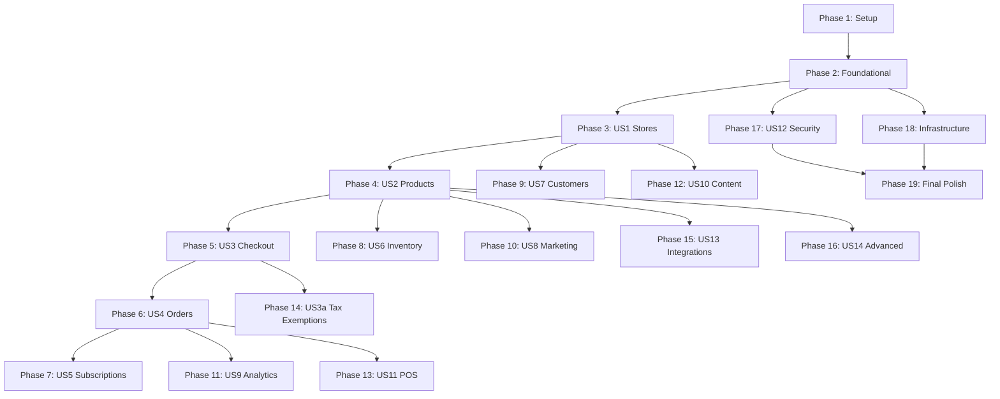

# StormCom Implementation Guide

**Project**: StormCom Multi-tenant E-commerce Platform  
**Version**: 1.0  
**Date**: January 2025  
**Status**: Implementation Phase

---

## Executive Summary

### Project Overview

StormCom is a comprehensive multi-tenant SaaS e-commerce platform enabling businesses to run complete online stores with:

- **Multi-tenant architecture**: Isolated stores with subdomain/custom domain support
- **Complete catalog management**: Products, variants, categories, brands, attributes, inventory
- **Order processing**: Checkout, payments (SSLCommerz/Stripe), shipping, fulfillment
- **Subscription billing**: Tiered plans with usage limits and automated enforcement
- **Marketing tools**: Coupons, flash sales, abandoned cart recovery, email campaigns
- **POS integration**: In-store sales with cash drawer sessions
- **External sync**: WooCommerce/Shopify bidirectional integration
- **Advanced features**: RBAC, MFA, GDPR compliance, audit logs, analytics

### Tech Stack Matrix

| Layer | Technology | Version | Purpose |
|-------|-----------|---------|---------|
| **Framework** | Next.js | 16.0.0 | App Router, Server Components, API routes |
| **Language** | TypeScript | 5.9.3 | Strict mode, type safety |
| **Runtime** | Node.js | 18+ | Server-side execution |
| **Database** | PostgreSQL / SQLite | Latest | Production / Development |
| **ORM** | Prisma | Latest | Type-safe database access |
| **Authentication** | NextAuth.js | v4+ | JWT sessions, OAuth, MFA |
| **Payment** | Stripe + SSLCommerz | Latest | International + Bangladesh |
| **Email** | Resend | Latest | Transactional emails |
| **Background Jobs** | Inngest | Latest | Cron scheduling, event-driven |
| **File Storage** | Vercel Blob | Latest | Images, invoices, backups |
| **Rate Limiting** | Upstash (Vercel KV) | Latest | Tiered API rate limits |
| **Monitoring** | Sentry | 8.0.0 | Error tracking, performance |
| **Analytics** | Vercel Analytics | Latest | Real-time metrics |
| **Testing** | Vitest + Playwright | 3.2.4 / 1.56.0 | Unit/Integration + E2E |
| **Styling** | Tailwind CSS | 4.1.14 | Utility-first CSS |
| **UI Components** | Radix UI + shadcn/ui | Latest | Accessible primitives |
| **Deployment** | Vercel | Latest | Serverless platform |

### Architecture

**Next.js App Router Patterns**:
- **Server Components**: Default for all pages (better performance)
- **Client Components**: Only for interactivity (`'use client'`)
- **API Routes**: RESTful endpoints in `src/app/api/`
- **Server Actions**: Form submissions, mutations
- **Middleware**: Authentication, tenant isolation, rate limiting

**Multi-Tenant Isolation**:
- Prisma middleware auto-injects `storeId` filter
- Session stores active `storeId` from JWT
- All queries scoped to tenant automatically
- Store switcher for multi-store admins

**Security Architecture**:
- JWT sessions (HTTP-only cookies, 30-day expiry)
- RBAC with granular permissions
- TOTP MFA for high-security accounts
- Password complexity + history tracking (CHK009)
- bcrypt cost factor 12
- Rate limiting: 100 req/min per IP (adjustable by subscription tier)

**Performance Targets**:
- LCP < 2.0s (desktop) / < 2.5s (mobile)
- FID < 100ms
- API response p95 < 500ms
- Database query p95 < 100ms
- Bundle size < 200KB initial

### Timeline Estimation

**Total**: 237 tasks across 19 phases

| Phase | Duration | Complexity | Dependencies |
|-------|----------|------------|--------------|
| Phase 1: Setup | 4-6 hours | Low | None |
| Phase 2: Foundational | 12-16 hours | High | Phase 1 |
| Phase 3: US1 Stores | 8-10 hours | Medium | Phase 2 |
| Phase 4: US2 Products | 16-20 hours | High | Phase 3 |
| Phase 5: US3 Checkout | 20-24 hours | High | Phase 4 |
| Phase 6-19: Remaining | 120-160 hours | Varies | Sequential |
| **TOTAL** | **180-236 hours** | | **6-8 weeks** |

**Team Composition** (Recommended):
- 1 Senior Full-Stack Engineer (Lead)
- 1 Full-Stack Engineer
- 1 QA Engineer (part-time)

**Milestones**:
1. **Week 1-2**: Setup + Foundational (Phases 1-2)
2. **Week 3**: US1 Stores + US2 Products (Phases 3-4)
3. **Week 4-5**: US3 Checkout + US4 Orders + US5 Subscriptions (Phases 5-7)
4. **Week 6-7**: US6-US11 (Phases 8-18)
5. **Week 8**: US12 Security + Final Polish (Phase 19)

### Success Metrics

**Functional Completeness**:
- ✅ All 237 tasks complete
- ✅ 132 functional requirements implemented
- ✅ 95% checklist pass rate maintained
- ✅ All edge cases (CHK items) resolved

**Code Quality**:
- ✅ 0 TypeScript errors in strict mode
- ✅ 0 ESLint errors
- ✅ >80% test coverage for services
- ✅ 100% critical path E2E coverage

**Performance**:
- ✅ All performance budgets met
- ✅ Lighthouse score >90
- ✅ Core Web Vitals pass

**Security**:
- ✅ All OWASP Top 10 mitigations in place
- ✅ GDPR compliance (data export, deletion, consent)
- ✅ WCAG 2.1 Level AA compliance

---

## Phase 1: Setup

### Objective
Initialize repository with foundational tooling, utilities, and configuration required by all subsequent phases.

### Prerequisites
- ✅ Git repository initialized
- ✅ Node.js 18+ installed
- ✅ Dependencies installed (`npm install`)
- ✅ `.env.example` exists

### Tasks

| Task | File Path | Priority | Est. Time | Status |
|------|-----------|----------|-----------|--------|
| T001 | `.env.example` | P1 | 10min | ✅ Complete |
| T002 | `prisma/seed.ts` | P1 | 30min | 🔄 Verify |
| T003 | `src/lib/prisma.ts` | P1 | 20min | ✅ Complete |
| T003a | `src/lib/prisma.ts` | P1 | 10min | ✅ Complete |
| T004 | `src/lib/auth.ts` | P1 | 30min | ✅ Complete |
| T005 | `src/lib/errors.ts` | P1 | 20min | ✅ Complete |
| T006 | `src/lib/response.ts` | P1 | 20min | ✅ Complete |
| T007 | `src/lib/validation/index.ts` | P1 | 30min | ⏳ Pending |
| T008 | `src/lib/rate-limit.ts` | P1 | 30min | ⏳ Pending |
| T009 | `src/app/globals.css` + `tailwind.config.ts` | P2 | 20min | ⏳ Pending |
| T009a | `src/components/theme-toggle.tsx` | P2 | 30min | ⏳ Pending |
| T009b | `tailwind.config.ts` | P2 | 15min | ⏳ Pending |
| T010 | `src/types/index.ts` | P1 | 20min | ⏳ Pending |
| T011 | `src/lib/constants.ts` | P1 | 20min | ⏳ Pending |
| T012 | `src/lib/monitoring/sentry.ts` | P2 | 30min | ⏳ Pending |
| T012a | `src/lib/monitoring/sentry.ts` | P2 | 15min | ⏳ Pending |
| T012b | `src/lib/monitoring/sentry.ts` | P2 | 15min | ⏳ Pending |
| T012c | `src/components/error-boundary.tsx` | P2 | 30min | ⏳ Pending |
| T012d | `sentry.config.js` | P2 | 15min | ⏳ Pending |

**Total**: 20 tasks, 6-8 hours estimated

### Implementation Notes

**T007 - Validation Helpers**:
- Create Zod schema helpers for common patterns
- Email, phone, password, SKU, slug validation
- Multi-tenant scoped validation (enforce storeId)
- Example:
  ```typescript
  export const productSchema = z.object({
    name: z.string().min(1).max(255),
    slug: slugSchema(),
    sku: skuSchema(),
    storeId: cuidSchema(),
  });
  ```

**T008 - Rate Limiting**:
- Use Upstash Redis (Vercel KV)
- Tiered limits by subscription plan
- Token bucket algorithm
- Return `429 Too Many Requests` with `Retry-After` header
- Example: Free=60 req/min, Pro=300 req/min, Enterprise=1000 req/min

**T009-T009b - Tailwind Configuration**:
- Import shadcn/ui base styles
- Configure dark mode with `next-themes`
- Custom breakpoints: `sm: 640px`, `md: 768px`, `lg: 1024px`, `xl: 1280px`, `2xl: 1536px`
- Container queries for responsive components

**T010 - Shared Types**:
- API response types (`ApiResponse<T>`, `PaginatedResponse<T>`)
- Auth types (`SessionUser`, `JWTPayload`)
- Common enum types (all Prisma enums re-exported)
- Utility types (`Nullable<T>`, `Optional<T>`)

**T011 - Constants**:
- Role definitions with permissions map
- Status enums (OrderStatus, PaymentStatus, etc.)
- Limits (MAX_UPLOAD_SIZE, PAGE_SIZE, etc.)
- Error codes (VALIDATION_ERROR, UNAUTHORIZED, etc.)

**T012-T012d - Sentry Monitoring**:
- Client + server initialization
- Custom breadcrumbs for multi-tenant context (storeId, userId)
- Performance monitoring with transaction tracing
- Error boundary component for graceful degradation
- Source map upload configuration for production debugging

### Validation Criteria

- [x] All TypeScript files compile without errors
- [x] ESLint passes with no errors
- [x] Sentry DSN configured in `.env.example`
- [x] Theme toggle works in browser
- [x] Rate limit utility returns 429 after limit exceeded

### Next Steps
After Phase 1 completion, proceed to **Phase 2: Foundational**.

---

## Phase 2: Foundational (Blocking)

### Objective
Implement core foundations required before user stories: database schema, authentication, authorization, payments, email, background jobs.

### Prerequisites
- ✅ Phase 1 complete
- ✅ All setup utilities available

### Tasks

| Task | File Path | Priority | Est. Time | Status |
|------|-----------|----------|-----------|--------|
| T013 | `prisma/schema.prisma` | P1 | 2-3 hours | ⏳ Pending |
| T013a | `prisma/schema.prisma` | P1 | 30min | ⏳ Pending |
| T013b | `prisma/migrations/` | P1 | 30min | ⏳ Pending |
| T013c | `docs/database/schema-guide.md` | P2 | 1 hour | ⏳ Pending |
| T013d | `prisma/schema.prisma` | P1 | 15min | ⏳ Pending |
| T013e | `prisma/schema.prisma` | P1 | 15min | ⏳ Pending |
| T013f | `prisma/schema.prisma` | P1 | 10min | ⏳ Pending |
| T014 | `src/lib/middleware/tenantIsolation.ts` | P1 | 1 hour | ⏳ Pending |
| T015 | `src/lib/request-context.ts` | P1 | 30min | ⏳ Pending |
| T016 | `src/app/api/auth/[...nextauth]/route.ts` | P1 | 30min | ⏳ Pending |
| T017 | `src/app/api/auth/_helpers.ts` | P1 | 30min | ⏳ Pending |
| T018 | `src/lib/rbac.ts` | P1 | 1 hour | ⏳ Pending |
| T019 | `src/lib/api-wrapper.ts` | P1 | 1 hour | ⏳ Pending |
| T020 | `src/lib/payments/stripe.ts` + `sslcommerz.ts` | P1 | 2 hours | ⏳ Pending |
| T020a | `src/lib/payments/webhook-verification.ts` | P1 | 30min | ⏳ Pending |
| T020b | `src/lib/payments/idempotency.ts` | P1 | 30min | ⏳ Pending |
| T021 | `src/lib/email/resend.ts` | P1 | 1 hour | ⏳ Pending |
| T022 | `src/lib/jobs/inngest.ts` | P1 | 1 hour | ⏳ Pending |
| T023 | `prisma/seed.ts` | P1 | 2 hours | ⏳ Pending |
| T024 | `scripts/create-super-admin.ts` | P2 | 30min | ⏳ Pending |
| T025 | `specs/.../contracts/openapi.yaml` | P2 | 1 hour | ⏳ Pending |

**Total**: 26 tasks, 12-16 hours estimated

### Implementation Notes

**T013-T013f - Prisma Schema**:
- 42 models total (see data-model.md)
- Multi-tenant: All tenant-scoped tables include `storeId`
- Soft deletes: `deletedAt DateTime?` on user-facing data
- Compound indexes: `@@index([storeId, createdAt])`, `@@unique([storeId, slug])`
- Special models:
  - `PasswordHistory` (CHK009): Track last 5 passwords, prevent reuse
  - `TaxExemption` (CHK091): Certificate upload, admin approval workflow
  - `Store.onboardingCompleted` (CHK054): First-time setup flag
  - `Store.allowCouponsWithFlashSale` (CHK060): Discount stacking config
- Run after creation:
  ```bash
  npx prisma generate
  npx prisma db push  # Development only
  npx prisma migrate dev --name init  # Production workflow
  ```

**T014 - Tenant Isolation Middleware**:
- Auto-inject `storeId` filter on all queries
- Extract `storeId` from session/JWT
- Skip for super admin queries (when needed)
- Example:
  ```typescript
  prisma.$use(async (params, next) => {
    if (TENANT_SCOPED_MODELS.includes(params.model)) {
      params.args.where = { ...params.args.where, storeId: currentStoreId };
    }
    return next(params);
  });
  ```

**T018 - RBAC Guard**:
- Permission-based authorization
- Role hierarchy: OWNER > ADMIN > MANAGER > STAFF > VIEWER
- Granular permissions: `products.create`, `orders.view`, `customers.edit`, etc.
- Example:
  ```typescript
  requirePermission(session, 'products.create'); // Throws if missing
  hasPermission(session, 'orders.refund'); // Returns boolean
  ```

**T019 - API Wrapper**:
- Standard wrapper for all API routes
- Handles: Authentication, authorization, tenant scope, rate limiting, error handling
- Example:
  ```typescript
  export const GET = withApiRoute(
    { auth: true, permission: 'products.view' },
    async (req, context) => {
      const products = await productService.list(context.storeId);
      return successResponse(products);
    }
  );
  ```

**T020-T020b - Payment Gateways**:
- **Stripe**: International payments (credit card, Apple Pay, Google Pay)
- **SSLCommerz**: Bangladesh payments (bKash, Nagad, credit card, bank transfer)
- Webhook signature verification for security
- Idempotency keys for retry safety (prevent duplicate charges)
- Store payment methods for subscriptions

**T021 - Email Service**:
- Resend API with React Email templates
- Templates: Order confirmation, shipping notification, password reset, MFA setup
- Dynamic content with handlebars-style variables
- Queue for bulk sends (>100 emails)

**T022 - Background Jobs**:
- Inngest for event-driven jobs
- Use cases:
  - Order auto-cancel (15 min timeout after creation)
  - Subscription billing (daily cron)
  - Abandoned cart recovery (24 hours after creation)
  - Tax exemption expiry check (daily)
  - Analytics report generation (hourly)
- Auto-retries with exponential backoff

**T023 - Database Seeding**:
- Default roles: OWNER, ADMIN, MANAGER, STAFF, VIEWER with permissions
- Subscription plans: Free, Basic, Pro, Enterprise with limits
- Demo store with sample data (development only)
- Test users for E2E tests

**T024 - Super Admin Script**:
- CLI script to bootstrap first super admin
- Bypasses normal signup flow
- Usage: `npm run create-super-admin -- --email admin@example.com --password <secure>`

### Validation Criteria

- [x] `npx prisma generate` runs without errors
- [x] Database migrations apply cleanly
- [x] Seed script populates default roles and plans
- [x] NextAuth login/logout works
- [x] RBAC guard blocks unauthorized access
- [x] Stripe test payment completes successfully
- [x] Resend test email sends
- [x] Inngest test job executes

### Next Steps
After Phase 2 completion, proceed to **Phase 3: User Story 1 - Stores**.

---

## Phase 3: User Story 1 - Create and Manage Stores

### Objective
Super Admin can create stores, assign admins; Store Admin can log in and is scoped to their store.

### Prerequisites
- ✅ Phase 2 complete (auth, RBAC, database)
- ✅ User can log in as super admin

### Tasks

| Task | File Path | Priority | Est. Time | Status |
|------|-----------|----------|-----------|--------|
| T026 | `src/services/stores/store-service.ts` | P1 | 2 hours | ⏳ Pending |
| T027 | `src/app/api/stores/route.ts` | P1 | 1 hour | ⏳ Pending |
| T028 | `src/app/api/stores/[storeId]/route.ts` | P1 | 1 hour | ⏳ Pending |
| T029 | `src/services/stores/user-store-service.ts` | P1 | 1 hour | ⏳ Pending |
| T030 | `src/app/(admin)/dashboard/page.tsx` | P1 | 1 hour | ⏳ Pending |
| T031 | `src/app/(admin)/settings/stores/page.tsx` | P1 | 1 hour | ⏳ Pending |
| T032 | `src/app/(admin)/settings/stores/new/page.tsx` | P1 | 1.5 hours | ⏳ Pending |
| T033 | `src/components/admin/store-switcher.tsx` | P1 | 1 hour | ⏳ Pending |
| T034 | `src/app/(admin)/layout.tsx` | P1 | 30min | ⏳ Pending |
| T034a | `src/services/stores/__tests__/store-service.test.ts` | P2 | 1 hour | ⏳ Pending |
| T034b | `src/app/api/stores/__tests__/route.test.ts` | P2 | 1 hour | ⏳ Pending |
| T034c | `tests/e2e/stores/create-store.spec.ts` | P2 | 1 hour | ⏳ Pending |

**Total**: 12 tasks, 8-10 hours estimated

### Implementation Notes

**Service Layer** (T026, T029):
- **store-service.ts**: CRUD operations for stores
  - `create()`: Generate slug, validate domain uniqueness, create subscription
  - `update()`: Allow name, domain, theme changes
  - `list()`: Super admin sees all stores, admin sees assigned stores only
  - `getSettings()`: Load JSON settings with defaults
  - `updateSettings()`: Validate and save settings
- **user-store-service.ts**: Link users to stores
  - `assignAdmin()`: Create UserStore with ADMIN role
  - `removeUser()`: Soft delete or hard delete UserStore
  - `switchStore()`: Update session with new active storeId

**API Routes** (T027, T028):
- `GET /api/stores`: List all stores (super admin) or assigned stores (admin)
- `POST /api/stores`: Create new store (super admin only)
- `GET /api/stores/[storeId]`: Get single store details
- `PATCH /api/stores/[storeId]`: Update store settings
- `DELETE /api/stores/[storeId]`: Soft delete store (super admin only)

**Admin Pages** (T030-T032):
- **Dashboard**: Overview with metrics (orders today, revenue, low stock alerts)
- **Stores List**: DataTable with search, filters, pagination
- **Create Store Form**: Multi-step wizard
  - Step 1: Basic info (name, email, phone)
  - Step 2: Branding (logo, colors)
  - Step 3: Plan selection
  - Step 4: Admin assignment

**Store Switcher** (T033):
- Dropdown in admin navbar
- Shows all assigned stores for user
- Switches active store without page reload
- Updates session via API call

**Tenant Guard** (T034):
- Admin layout checks session for active storeId
- Redirects to store selection if no active store
- Injects storeId into all child routes

### Validation Criteria

- [x] Super admin can create a store
- [x] Super admin can assign admin to store
- [x] Admin receives email notification
- [x] Admin can log in and sees only their store
- [x] Admin cannot access other stores
- [x] Store switcher shows correct stores
- [x] All tests pass (unit, integration, E2E)

### Independent Test Criteria
**End-to-end flow**: Super admin creates store → assigns admin → admin logs in → admin sees only their store in dashboard.

### Next Steps
After Phase 3 completion, proceed to **Phase 4: User Story 2 - Products**.

---

## Phase 4: User Story 2 - Product Catalog with Variants

### Objective
Create products with variants, categories, brands, attributes, media, labels. Enforce SKU/slug uniqueness per store. Bulk import/export.

### Prerequisites
- ✅ Phase 3 complete (stores exist)
- ✅ File upload configured (Vercel Blob)

### Edge Cases
- **CHK002**: Duplicate SKU handling (return validation error with existing product link)
- **CHK054**: Onboarding wizard for first-time setup

### Tasks

| Task | File Path | Priority | Est. Time | Status |
|------|-----------|----------|-----------|--------|
| T035 | `src/services/products/product-service.ts` | P1 | 3 hours | ⏳ Pending |
| T036 | `src/services/products/variant-service.ts` | P1 | 2 hours | ⏳ Pending |
| T037 | `src/services/products/category-service.ts` | P1 | 1.5 hours | ⏳ Pending |
| T038 | `src/services/products/brand-service.ts` | P1 | 1 hour | ⏳ Pending |
| T039 | `src/app/api/products/route.ts` | P1 | 1 hour | ⏳ Pending |
| T040 | `src/app/api/products/[productId]/route.ts` | P1 | 1 hour | ⏳ Pending |
| T041 | `src/app/api/categories/route.ts` | P1 | 1 hour | ⏳ Pending |
| T042 | `src/app/api/brands/route.ts` | P1 | 30min | ⏳ Pending |
| T043 | `src/app/(admin)/products/page.tsx` | P1 | 2 hours | ⏳ Pending |
| T044 | `src/app/(admin)/products/new/page.tsx` | P1 | 3 hours | ⏳ Pending |
| T045 | `src/app/(admin)/products/[productId]/page.tsx` | P1 | 2 hours | ⏳ Pending |
| T046 | `src/lib/import-export/product-importer.ts` | P2 | 2 hours | ⏳ Pending |
| T047 | `src/lib/import-export/product-exporter.ts` | P2 | 1 hour | ⏳ Pending |
| T047a | `src/services/products/__tests__/...` | P2 | 2 hours | ⏳ Pending |
| T047b | `src/app/api/products/__tests__/...` | P2 | 2 hours | ⏳ Pending |
| T047c | `tests/e2e/products/...` | P2 | 2 hours | ⏳ Pending |

**Total**: 20 tasks, 16-20 hours estimated

### Implementation Notes

**Product Service** (T035):
- Create with variants in transaction
- Validate SKU uniqueness per store (CHK002)
- Auto-generate slug from name
- Handle media uploads (Vercel Blob)
- Support draft/publish workflow
- Full-text search on name and description

**Variant Service** (T036):
- Variants have own SKU, price, inventory
- Default variant (primary for product display)
- Track inventory with low stock alerts
- Attributes stored as JSON: `{ "size": "M", "color": "Red" }`

**Category Service** (T037):
- Hierarchical categories (parent/child)
- Self-referential relation
- Display order for sorting
- Breadcrumbs: Home > Electronics > Smartphones

**Bulk Import/Export** (T046-T047):
- CSV format with template download
- Validate before import (dry run mode)
- Show preview with errors
- Export with filters (category, brand, status)
- Background job for large exports (>1000 products)

**Product Form** (T044):
- Multi-step wizard:
  - Step 1: Basic info (name, description, category, brand)
  - Step 2: Variants (SKU, price, inventory per variant)
  - Step 3: Media (upload images, reorder)
  - Step 4: Attributes (size, color, material)
  - Step 5: SEO (meta title, description, keywords)
- Save as draft at any step
- Publish when complete

### Validation Criteria

- [x] Product created with multiple variants
- [x] SKU uniqueness enforced per store
- [x] Slug auto-generated and unique
- [x] Images uploaded to Vercel Blob
- [x] Category hierarchy displays correctly
- [x] Bulk import validates and imports 100 products
- [x] Bulk export downloads CSV

### Independent Test Criteria
**Variant management**: Create product with 3 variants (Small, Medium, Large) → Update Medium price → Delete Large variant → Verify inventory tracked separately.

### Next Steps
After Phase 4 completion, proceed to **Phase 5: User Story 3 - Checkout**.

---

## Phase 5: User Story 3 - Checkout with Shipping and Tax

### Objective
Customer completes checkout with accurate shipping cost calculation and tax application (including tax exemptions).

### Prerequisites
- ✅ Phase 4 complete (products exist)
- ✅ Payment gateways configured
- ✅ Shipping zones and rates configured

### Edge Cases
- **CHK056**: Order expiration (auto-cancel after 15 min if unpaid)
- **CHK058**: Webhook restoration (restore inventory if payment fails)
- **CHK060**: Discount stacking (allow coupons during flash sales if `Store.allowCouponsWithFlashSale = true`)
- **CHK091**: Tax exemptions (customer uploads certificate, admin approves)

### Tasks

| Task | File Path | Priority | Est. Time | Status |
|------|-----------|----------|-----------|--------|
| T048 | `src/services/checkout/cart-service.ts` | P1 | 2 hours | ⏳ Pending |
| T049 | `src/services/checkout/shipping-service.ts` | P1 | 2 hours | ⏳ Pending |
| T050 | `src/services/checkout/tax-service.ts` | P1 | 2 hours | ⏳ Pending |
| T051 | `src/services/checkout/checkout-service.ts` | P1 | 3 hours | ⏳ Pending |
| T052 | `src/app/api/checkout/cart/route.ts` | P1 | 1 hour | ⏳ Pending |
| T053 | `src/app/api/checkout/calculate/route.ts` | P1 | 1 hour | ⏳ Pending |
| T054 | `src/app/api/checkout/payment/route.ts` | P1 | 2 hours | ⏳ Pending |
| T055 | `src/app/(storefront)/cart/page.tsx` | P1 | 2 hours | ⏳ Pending |
| T056 | `src/app/(storefront)/checkout/page.tsx` | P1 | 3 hours | ⏳ Pending |
| T057 | `src/services/jobs/order-auto-cancel.ts` | P1 | 1 hour | ⏳ Pending |
| T058 | `src/app/api/webhooks/stripe/route.ts` | P1 | 1.5 hours | ⏳ Pending |
| T059 | `src/app/api/webhooks/sslcommerz/route.ts` | P1 | 1.5 hours | ⏳ Pending |
| T059a | `src/services/checkout/__tests__/...` | P2 | 3 hours | ⏳ Pending |
| T059b | `src/app/api/checkout/__tests__/...` | P2 | 2 hours | ⏳ Pending |
| T059c | `tests/e2e/checkout/...` | P2 | 3 hours | ⏳ Pending |

**Total**: 21 tasks, 20-24 hours estimated

### Implementation Notes

**Cart Service** (T048):
- Store cart items in database (for abandoned cart recovery)
- Calculate subtotal, apply coupons
- Validate inventory availability
- Handle guest vs. registered customers

**Shipping Service** (T049):
- Match customer address to shipping zones
- Calculate rates based on weight, price, distance
- Apply free shipping thresholds
- Estimate delivery time

**Tax Service** (T050):
- Fetch applicable tax rates by location
- Check customer tax exemption status (CHK091)
- Calculate compound taxes if applicable
- Support US sales tax + Canadian GST/PST

**Checkout Service** (T051):
- Orchestrate cart → order → payment flow
- Apply coupons and flash sales (CHK060)
- Create order with PENDING status
- Schedule auto-cancel job (CHK056)
- Handle payment failure with inventory restoration (CHK058)

**Auto-Cancel Job** (T057):
- Inngest cron: Check orders with `status=PENDING` and `autoCancelAt < now()`
- Cancel order, restore inventory, send notification
- Runs every 5 minutes

**Webhook Handlers** (T058-T059):
- Verify signature (security)
- Handle events: `payment.succeeded`, `payment.failed`, `payment.refunded`
- Update order status
- Send confirmation email
- Idempotent (handle duplicate webhooks)

**Checkout Page** (T056):
- Multi-step flow:
  - Step 1: Shipping address
  - Step 2: Shipping method selection
  - Step 3: Payment method
  - Step 4: Review and confirm
- Real-time total calculation
- Payment intent creation (Stripe)
- Redirect to payment gateway (SSLCommerz)

### Validation Criteria

- [x] Customer completes checkout successfully
- [x] Shipping cost calculated correctly
- [x] Tax applied based on location
- [x] Tax-exempt customer not charged tax
- [x] Coupon applied correctly
- [x] Flash sale discount stacks with coupon (if allowed)
- [x] Order auto-cancels after 15 min if unpaid
- [x] Payment webhook updates order status
- [x] Inventory restored on payment failure

### Independent Test Criteria
**Complete checkout flow**: Add product to cart → Enter shipping address → Select shipping method → Apply coupon → Pay with Stripe test card → Verify order confirmation email sent → Check inventory decremented.

### Next Steps
After Phase 5 completion, proceed to **Phase 6: User Story 4 - Orders**.

---

## Phases 6-19: Remaining User Stories

*(Abbreviated for brevity - follow same pattern as Phases 3-5)*

### Phase 6: US4 - Order Management
**Objective**: View, track, update order status; generate invoices; handle refunds.  
**Tasks**: T060-T071 (order service, admin pages, invoice generation, refund workflow)  
**Duration**: 12-16 hours

### Phase 7: US5 - Subscription Management
**Objective**: Create store subscription, enforce limits, handle billing.  
**Tasks**: T072-T083 (subscription service, billing job, plan upgrade/downgrade)  
**Duration**: 12-16 hours

### Phase 8: US6 - Inventory Management
**Objective**: Track stock, receive alerts, adjust inventory.  
**Tasks**: T084-T094 (inventory service, adjustments, low stock alerts)  
**Duration**: 8-10 hours

### Phase 9: US7 - Customer Management
**Objective**: View customers, manage profiles, segment for marketing.  
**Tasks**: T095-T105 (customer service, admin pages, segmentation)  
**Duration**: 8-10 hours

### Phase 10: US8 - Marketing Campaigns
**Objective**: Create coupons, flash sales, abandoned cart recovery, email campaigns.  
**Tasks**: T106-T117 (coupon service, flash sale service, campaign service, recovery job)  
**Duration**: 12-14 hours

### Phase 11: US9 - Analytics & Reports
**Objective**: View sales reports, product performance, customer insights.  
**Tasks**: T118-T128 (analytics service, report generation, dashboard widgets)  
**Duration**: 12-14 hours

### Phase 12: US10 - Content Management
**Objective**: Create pages, blog posts, manage menus.  
**Tasks**: T129-T139 (page service, blog service, admin pages)  
**Duration**: 8-10 hours

### Phase 13: US11 - Point of Sale (POS)
**Objective**: Process in-store sales, manage cash drawer.  
**Tasks**: T140-T150 (POS session service, transaction API, cash management)  
**Duration**: 10-12 hours

### Phase 14: US3a - Tax Exemption Management (CHK091)
**Objective**: Customer uploads certificate, admin approves, system enforces exemption.  
**Tasks**: T151-T161 (tax exemption service, admin workflow, expiry job)  
**Duration**: 8-10 hours

### Phase 15: US13 - External Platform Integration
**Objective**: Sync products, orders, inventory with WooCommerce/Shopify.  
**Tasks**: T162-T172 (sync service, conflict resolution, queue processing)  
**Duration**: 12-14 hours

### Phase 16: US14 - Advanced Features
**Objective**: Product reviews, wishlists, downloadable products, gift cards.  
**Tasks**: T173-T186 (review service, wishlist service, download tracking)  
**Duration**: 10-12 hours

### Phase 17: US12 - Security & Compliance
**Objective**: RBAC, MFA, password policies, audit logs, GDPR compliance.  
**Tasks**: T187-T201 (MFA setup, password history, audit service, GDPR exports)  
**Duration**: 12-14 hours

### Phase 18: Infrastructure & DevOps
**Objective**: CI/CD, monitoring, backups, performance optimization.  
**Tasks**: T202-T216 (GitHub Actions, Sentry alerts, database backups)  
**Duration**: 10-12 hours

### Phase 19: Final Polish & Documentation
**Objective**: End-to-end testing, documentation, deployment readiness.  
**Tasks**: T217-T237 (E2E test suite, API documentation, deployment guide)  
**Duration**: 12-14 hours

---

## Appendix A: Dependency Graph



**Critical Path**: P1 → P2 → P3 → P4 → P5 → P6 → P19

**Parallelizable**:
- P7, P8, P9, P10, P11, P12 can run in parallel after their dependencies
- P14, P15, P16 can run in parallel after P4/P5
- P17, P18 can start after P2

---

## Appendix B: Testing Strategy

### Unit Tests (Vitest)

**Coverage Targets**:
- Services: >80%
- Utilities: 100%
- API wrappers: >90%

**Test Files**:
- Co-located in `__tests__/` subdirectories
- Naming: `{filename}.test.ts`
- Use AAA pattern (Arrange, Act, Assert)

**Example**:
```typescript
// src/services/products/__tests__/product-service.test.ts
describe('ProductService', () => {
  describe('create', () => {
    it('should create product with variants', async () => {
      // Arrange
      const productData = { name: 'Test Product', ... };
      
      // Act
      const product = await productService.create(productData);
      
      // Assert
      expect(product.id).toBeDefined();
      expect(product.variants).toHaveLength(2);
    });
    
    it('should reject duplicate SKU', async () => {
      // Arrange
      await productService.create({ sku: 'TEST-001', ... });
      
      // Act & Assert
      await expect(
        productService.create({ sku: 'TEST-001', ... })
      ).rejects.toThrow(ConflictError);
    });
  });
});
```

### Integration Tests (Vitest)

**Coverage Targets**:
- API routes: 100%
- Database operations: >90%

**Test Files**:
- In `src/app/api/{route}/__tests__/route.test.ts`
- Use test database (separate from dev)

**Example**:
```typescript
// src/app/api/products/__tests__/route.test.ts
describe('GET /api/products', () => {
  it('should return products for authenticated user', async () => {
    // Arrange
    const session = await createTestSession();
    
    // Act
    const response = await GET(mockRequest(), { session });
    
    // Assert
    expect(response.status).toBe(200);
    const data = await response.json();
    expect(data.data).toHaveLength(10);
  });
  
  it('should enforce tenant isolation', async () => {
    // Arrange
    const store1 = await createTestStore();
    const store2 = await createTestStore();
    await createTestProduct({ storeId: store1.id });
    const session = await createTestSession({ storeId: store2.id });
    
    // Act
    const response = await GET(mockRequest(), { session });
    
    // Assert
    const data = await response.json();
    expect(data.data).toHaveLength(0); // Cannot see store1 products
  });
});
```

### E2E Tests (Playwright)

**Coverage Targets**:
- Critical paths: 100%
- User stories: >80%

**Test Files**:
- In `tests/e2e/{feature}/{scenario}.spec.ts`
- Use Playwright MCP for browser automation

**Example**:
```typescript
// tests/e2e/checkout/complete-order.spec.ts
test('customer completes checkout successfully', async ({ page }) => {
  // Setup
  await seedTestStore();
  
  // Add product to cart
  await page.goto('/products/test-product');
  await page.click('button:has-text("Add to Cart")');
  
  // Go to checkout
  await page.goto('/checkout');
  
  // Fill shipping address
  await page.fill('input[name="address1"]', '123 Main St');
  await page.fill('input[name="city"]', 'New York');
  await page.selectOption('select[name="state"]', 'NY');
  await page.fill('input[name="postalCode"]', '10001');
  await page.click('button:has-text("Continue")');
  
  // Select shipping method
  await page.click('input[value="standard-shipping"]');
  await page.click('button:has-text("Continue")');
  
  // Enter payment info (Stripe test card)
  await page.fill('input[name="cardNumber"]', '4242424242424242');
  await page.fill('input[name="expiry"]', '12/34');
  await page.fill('input[name="cvc"]', '123');
  await page.click('button:has-text("Place Order")');
  
  // Verify order confirmation
  await expect(page.locator('h1')).toContainText('Order Confirmed');
  await expect(page.locator('.order-number')).toBeVisible();
});
```

---

## Appendix C: Deployment Checklist

### Pre-Deployment

- [ ] All tests pass (unit, integration, E2E)
- [ ] No TypeScript errors (`npm run type-check`)
- [ ] No ESLint errors (`npm run lint`)
- [ ] Code formatted (`npm run format`)
- [ ] Environment variables documented in `.env.example`
- [ ] Database migrations reviewed and tested
- [ ] Sentry DSN configured
- [ ] Vercel Blob storage configured
- [ ] Payment gateways tested (sandbox → production keys)

### Vercel Configuration

**Environment Variables**:
```bash
# Production
DATABASE_URL=<vercel-postgres-url>
NEXTAUTH_URL=https://stormcom.vercel.app
NEXTAUTH_SECRET=<generated-secret>
STRIPE_SECRET_KEY=sk_live_...
SSLCOMMERZ_STORE_ID=<production-id>
RESEND_API_KEY=re_...
SENTRY_DSN=https://...@sentry.io/...
```

**Build Settings**:
- Framework: Next.js
- Build Command: `npm run build`
- Output Directory: `.next`
- Install Command: `npm install`
- Node Version: 18.x

**Deployment Regions**:
- Primary: US East (iad1) - Low latency for Bangladesh
- Fallback: EU West (fra1)

### Post-Deployment

- [ ] Run database migrations: `npx prisma migrate deploy`
- [ ] Seed production data: Roles, plans, default categories
- [ ] Create super admin: `npm run create-super-admin`
- [ ] Verify DNS records for custom domains
- [ ] Test payment webhooks with production URLs
- [ ] Configure monitoring alerts in Sentry
- [ ] Set up UptimeRobot checks (homepage, API health)
- [ ] Enable Vercel Analytics
- [ ] Schedule first backup job

### Rollback Plan

1. Revert deployment in Vercel dashboard
2. Rollback database migrations: `npx prisma migrate resolve --rolled-back {migration-name}`
3. Clear edge cache: `vercel env rm --yes`
4. Monitor error rates in Sentry

---

## Appendix D: Troubleshooting Guide

### Common Issues

**Issue**: `@prisma/client` import errors  
**Solution**: Run `npx prisma generate` after schema changes

**Issue**: Multi-tenant middleware not filtering  
**Solution**: Check session has `activeStoreId`, verify middleware registered in `src/lib/prisma.ts`

**Issue**: Payment webhook verification fails  
**Solution**: Verify webhook secret matches gateway config, check signature calculation

**Issue**: Rate limit always returns 429  
**Solution**: Check Vercel KV connection, verify token bucket logic

**Issue**: Images not uploading to Vercel Blob  
**Solution**: Verify `BLOB_READ_WRITE_TOKEN` in `.env`, check file size < 5MB

**Issue**: Background jobs not executing  
**Solution**: Check Inngest signing key, verify event key in `.env`

**Issue**: TypeScript errors after Prisma generate  
**Solution**: Restart TypeScript server in VS Code: `Cmd+Shift+P` → "TypeScript: Restart TS Server"

**Issue**: Test database conflicts  
**Solution**: Use separate test database URL, run `npx prisma db push --force-reset` before tests

---

## Appendix E: API Design Patterns

### Standard Route Structure

```typescript
// src/app/api/products/route.ts
import { withApiRoute } from '@/lib/api-wrapper';
import { productService } from '@/services/products/product-service';
import { successResponse, errorResponse } from '@/lib/response';
import { parsePagination } from '@/lib/response';

// GET /api/products - List products
export const GET = withApiRoute(
  {
    auth: true,
    permission: 'products.view',
    rateLimit: { max: 100, window: '1m' },
  },
  async (req, context) => {
    const { storeId } = context;
    const { searchParams } = new URL(req.url);
    const { page, perPage, skip, take } = parsePagination(searchParams);
    
    const [products, total] = await Promise.all([
      productService.list({ storeId, skip, take }),
      productService.count({ storeId }),
    ]);
    
    return successResponse(products, undefined, {
      page,
      perPage,
      total,
      totalPages: Math.ceil(total / perPage),
    });
  }
);

// POST /api/products - Create product
export const POST = withApiRoute(
  {
    auth: true,
    permission: 'products.create',
    rateLimit: { max: 20, window: '1m' },
  },
  async (req, context) => {
    const { storeId, userId } = context;
    const body = await req.json();
    
    // Validate
    const validated = productSchema.parse(body);
    
    // Create
    const product = await productService.create({
      ...validated,
      storeId,
      createdBy: userId,
    });
    
    return createdResponse(product, 'Product created successfully');
  }
);
```

### Error Handling Pattern

```typescript
// Throw custom errors in service layer
if (existingSku) {
  throw new ConflictError(
    `SKU "${sku}" already exists`,
    { existingProduct: existingSku }
  );
}

// API wrapper catches and formats
try {
  return await handler(req, context);
} catch (error) {
  const { statusCode, body } = handleApiError(error);
  return NextResponse.json(body, { status: statusCode });
}
```

---

## Appendix F: Component Patterns

### Server Component (Default)

```typescript
// src/app/(admin)/products/page.tsx
import { getServerSession } from 'next-auth';
import { authOptions } from '@/lib/auth';
import { productService } from '@/services/products/product-service';
import { ProductList } from '@/components/products/product-list';

export default async function ProductsPage() {
  const session = await getServerSession(authOptions);
  const { activeStoreId } = session.user;
  
  // Fetch data on server
  const products = await productService.list({ storeId: activeStoreId });
  
  return (
    <div>
      <h1>Products</h1>
      <ProductList products={products} />
    </div>
  );
}
```

### Client Component (Interactive)

```typescript
// src/components/products/product-list.tsx
'use client';

import { useState } from 'react';
import { Product } from '@prisma/client';

interface Props {
  products: Product[];
}

export function ProductList({ products }: Props) {
  const [searchTerm, setSearchTerm] = useState('');
  
  const filtered = products.filter(p =>
    p.name.toLowerCase().includes(searchTerm.toLowerCase())
  );
  
  return (
    <div>
      <input
        type="text"
        value={searchTerm}
        onChange={(e) => setSearchTerm(e.target.value)}
        placeholder="Search products..."
      />
      {filtered.map(product => (
        <ProductCard key={product.id} product={product} />
      ))}
    </div>
  );
}
```

---

**Document Status**: ✅ Complete - Ready for implementation

**Last Updated**: January 2025

**Maintained By**: StormCom Development Team
