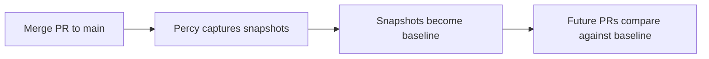
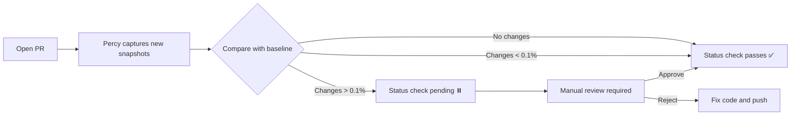

# Percy Visual Regression Testing Guide

**StormCom Multi-tenant E-commerce Platform**  
**Constitution Requirement**: Percy integration with 0.1% difference threshold  
**Status**: ✅ Implemented (T043)

---

## Overview

Percy is a visual regression testing platform that captures screenshots of your application and compares them against baseline images to detect unintended visual changes. StormCom uses Percy to ensure UI consistency across:

- **Critical Pages**: Dashboard, Checkout, Product List, Admin Settings
- **Viewports**: Mobile (375px), Tablet (768px), Desktop (1280px)
- **Browsers**: Chromium (via Playwright)
- **Threshold**: 0.1% difference (blocking deployment if exceeded)

---

## Quick Start

### Prerequisites

1. **Percy Account**: Sign up at [percy.io](https://percy.io)
2. **Percy Token**: Get from [Percy Settings](https://percy.io/settings)
3. **Environment Variable**: Set `PERCY_TOKEN` in your shell or `.env.local`

```bash
# Add to .env.local (DO NOT commit this file)
PERCY_TOKEN=your_percy_token_here
```

### Running Percy Tests Locally

```bash
# 1. Start Next.js dev server
npm run dev

# 2. Run Percy visual tests (in new terminal)
npm run test:percy

# 3. View results in Percy dashboard
# https://percy.io/[your-org]/stormcom
```

### Running Percy Tests in CI

Percy tests run automatically on every PR via GitHub Actions:

- **Workflow**: `.github/workflows/percy-visual-regression.yml`
- **Trigger**: Pull requests to `main`, `develop`, or `feature/**` branches
- **Status Check**: Required for PR merge (if visual differences > 0.1%)

---

## Percy Workflow

### 1. Baseline Creation (First Run)

When you first merge visual tests to `main`, Percy creates baseline snapshots:



**Steps**:
1. Create PR with visual tests
2. Merge PR to `main` branch
3. Percy captures snapshots from `main`
4. These snapshots become the baseline

### 2. Visual Change Detection (Every PR)

When you open a PR, Percy compares snapshots against baseline:



**Steps**:
1. Make UI changes in feature branch
2. Open PR → Percy runs automatically
3. View comparison in Percy dashboard
4. **If changes > 0.1%**:
   - Review snapshots in Percy UI
   - Approve (intentional changes) or reject (unintended changes)
   - Once approved, status check passes
5. Merge PR → New snapshots become baseline

### 3. Visual Approval Process

**Percy Dashboard**: https://percy.io/[org]/stormcom

1. **Navigate to Build**:
   - Click on PR build in Percy dashboard
   - View snapshot comparison grid

2. **Review Snapshots**:
   - Red highlights = pixels that changed
   - Slider to compare before/after
   - Zoom and inspect details

3. **Approve or Reject**:
   - **Approve**: Visual change is intentional (new feature, design update)
   - **Reject**: Visual change is unintended (bug, regression)

4. **Status Check**:
   - Once all snapshots approved → GitHub status check passes
   - PR can be merged

---

## Configuration

### Percy Configuration (`.percy.yml`)

```yaml
version: 2

snapshot:
  widths:
    - 375   # Mobile
    - 768   # Tablet
    - 1280  # Desktop
  min-height: 1024

visual-review:
  threshold: 0.001  # 0.1% difference
  baseline-branch: main
  auto-approve-unchanged: true

parallel:
  total: 5  # 5 parallel workers
```

### Test Configuration (`tests/visual/percy.spec.ts`)

**Critical Pages Tested**:
- ✅ Storefront: Homepage, Product List, Product Detail, Cart, Checkout
- ✅ Dashboard: Overview, Products, Orders, Customers, Settings
- ✅ Admin: Dashboard, Stores List
- ✅ Responsive: Mobile menu, Tablet grid, Desktop full width

**Percy Snapshot Naming**:
```typescript
await percySnapshot(page, 'Context - Page - State', {
  percyCSS: PERCY_CSS,  // Hide dynamic content
});

// Examples:
// "Storefront - Homepage"
// "Dashboard - Products List"
// "Checkout - Payment Step"
// "Mobile - Navigation Menu Open"
```

---

## npm Scripts

```json
{
  "test:percy": "percy exec -- playwright test tests/visual/percy.spec.ts",
  "test:percy:local": "percy exec --verbose -- playwright test tests/visual/percy.spec.ts",
  "percy:baseline": "percy exec -- playwright test tests/visual/percy.spec.ts --update-snapshots"
}
```

**Usage**:

```bash
# Run Percy tests (requires PERCY_TOKEN)
npm run test:percy

# Run with verbose output (debugging)
npm run test:percy:local

# Update baseline snapshots (after intentional changes)
npm run percy:baseline
```

---

## GitHub Actions Integration

### Workflow Configuration

**File**: `.github/workflows/percy-visual-regression.yml`

**Triggers**:
- Pull requests to `main`, `develop`, `feature/**`
- Push to `main` (baseline update)
- Manual dispatch (baseline reset)

**Jobs**:
1. **percy-visual-tests**: Capture snapshots in parallel (2 shards)
2. **percy-finalize**: Finalize Percy build
3. **percy-status-check**: Post PR comment with results

### Required Secrets

Add `PERCY_TOKEN` to GitHub repository secrets:

1. Go to `Settings` → `Secrets and variables` → `Actions`
2. Click `New repository secret`
3. Name: `PERCY_TOKEN`
4. Value: Your Percy token from [percy.io/settings](https://percy.io/settings)
5. Click `Add secret`

### Status Checks

Percy adds a status check to your PR:

- ✅ **All snapshots approved**: Check passes
- ⏸️ **Snapshots pending review**: Check blocked
- ❌ **Snapshots rejected**: Check failed

**Required for merge**: Enable in GitHub repository settings:
- `Settings` → `Branches` → `main` → `Require status checks`
- Check `Percy`

---

## Best Practices

### 1. Hide Dynamic Content

Use `percyCSS` to hide content that changes on every render:

```typescript
const PERCY_CSS = `
  [data-testid="timestamp"],
  [data-testid="last-updated"] {
    visibility: hidden !important;
  }
`;

await percySnapshot(page, 'Page Name', { percyCSS: PERCY_CSS });
```

### 2. Disable Animations

Animations can cause snapshot inconsistencies:

```typescript
const PERCY_CSS = `
  *, *::before, *::after {
    animation-duration: 0s !important;
    transition-duration: 0s !important;
  }
`;
```

### 3. Wait for Network Idle

Ensure page is fully loaded before capturing:

```typescript
await page.goto(url);
await page.waitForLoadState('networkidle');
await percySnapshot(page, 'Page Name');
```

### 4. Use Seeded Test Data

Ensure consistent test data across runs:

```bash
# Reset and seed test database before running Percy
npx prisma db push
npx prisma db seed
npm run test:percy
```

### 5. Test Critical User Flows

Focus on pages users interact with most:

- ✅ Checkout flow (cart → shipping → payment)
- ✅ Product browsing (list → detail → cart)
- ✅ Dashboard analytics (overview → reports)
- ✅ Admin settings (store config → users)

### 6. Review Snapshots Before Approving

Always review visual changes carefully:

- **Intentional changes**: New features, design updates, bug fixes
- **Unintended changes**: Regressions, layout shifts, styling bugs

### 7. Use Descriptive Snapshot Names

Good snapshot names make reviews easier:

```typescript
// ✅ GOOD: Clear context and state
await percySnapshot(page, 'Checkout - Payment Step - Credit Card Selected');

// ❌ BAD: Vague or missing context
await percySnapshot(page, 'Payment Page');
```

---

## Troubleshooting

### Percy Token Not Found

**Error**: `Error: Missing Percy token`

**Solution**:
```bash
# Add PERCY_TOKEN to .env.local
echo "PERCY_TOKEN=your_percy_token_here" >> .env.local

# Or export in shell
export PERCY_TOKEN=your_percy_token_here
```

### Snapshots Are Inconsistent

**Problem**: Snapshots differ on every run (dynamic timestamps, animations)

**Solution**:
1. Add dynamic elements to `percyCSS` hide list
2. Verify animations are disabled
3. Ensure test data is seeded consistently
4. Wait for `networkidle` before capturing

### Percy Build Stuck in Processing

**Problem**: Percy build shows "Processing" for > 10 minutes

**Solution**:
1. Check Percy dashboard for build errors
2. Verify webhook configuration in Percy settings
3. Re-run workflow via GitHub Actions
4. Contact Percy support if issue persists

### Status Check Not Updating

**Problem**: GitHub status check doesn't reflect Percy approval

**Solution**:
1. Wait 1-2 minutes for Percy to process
2. Check Percy webhook configuration
3. Verify `PERCY_TOKEN` permissions
4. Re-run `percy-status-check` job

### Parallel Builds Failing

**Problem**: Sharded tests fail with "Build not found" error

**Solution**:
1. Ensure `PERCY_PARALLEL_NONCE` is unique per run
2. Verify `PERCY_PARALLEL_TOTAL` matches shard count
3. Check Percy CLI logs for errors
4. Reduce shard count from 2 to 1 if needed

---

## Cost Optimization

### Percy Pricing Tiers

- **Free**: 5,000 snapshots/month
- **Team**: 25,000 snapshots/month ($299/mo)
- **Enterprise**: Unlimited snapshots (custom pricing)

### Reducing Snapshot Count

1. **Target Critical Pages**: Focus on high-traffic pages (50% fewer snapshots)
2. **Skip Low-Risk Changes**: Don't run Percy for docs-only PRs
3. **Use Conditional Triggers**: Only run on specific file changes
4. **Optimize Viewport Testing**: Test mobile + desktop only (skip tablet)

**Example workflow optimization**:

```yaml
# Only run Percy if UI code changed
on:
  pull_request:
    paths:
      - 'src/app/**'
      - 'src/components/**'
      - 'src/styles/**'
      # Skip docs, tests, scripts
      - '!docs/**'
      - '!tests/unit/**'
```

---

## Maintenance

### Updating Baseline Snapshots

When you intentionally change UI (new feature, design update):

```bash
# 1. Make UI changes in feature branch
git checkout feature/new-design

# 2. Run Percy tests locally
npm run test:percy

# 3. Review snapshots in Percy dashboard
# https://percy.io/[org]/stormcom

# 4. Approve snapshots in Percy UI

# 5. Merge PR to main
git push origin feature/new-design
# Create PR → Approve Percy changes → Merge

# 6. New snapshots become baseline
```

### Reverting to Previous Baseline

If you need to revert to a previous baseline:

**Option 1: Manual in Percy Dashboard**
1. Find previous build in Percy
2. Click `Set as baseline`
3. Confirm

**Option 2: Revert Code Changes**
1. Revert UI changes in git
2. Merge revert PR
3. Percy captures old snapshots as new baseline

### Adding New Pages to Percy

```typescript
// tests/visual/percy.spec.ts

test('New Page - Description', async ({ page }) => {
  await page.goto(`${BASE_URL}/new-page`);
  await page.waitForLoadState('networkidle');
  
  await percySnapshot(page, 'Context - New Page', {
    percyCSS: PERCY_CSS,
  });
});
```

---

## Resources

### Documentation

- **Percy Docs**: https://docs.percy.io/
- **Percy Playwright**: https://docs.percy.io/docs/playwright
- **Percy CI Setup**: https://docs.percy.io/docs/ci-setup
- **Percy GitHub Integration**: https://docs.percy.io/docs/github

### Support

- **Percy Support**: support@percy.io
- **Percy Status**: https://status.percy.io/
- **Percy Community**: https://community.percy.io/

### Internal

- **Percy Dashboard**: https://percy.io/[org]/stormcom
- **GitHub Workflow**: `.github/workflows/percy-visual-regression.yml`
- **Percy Config**: `.percy.yml`
- **Visual Tests**: `tests/visual/percy.spec.ts`

---

## Summary

Percy visual regression testing is **required** for StormCom (constitution compliance):

- ✅ **Installed**: `@percy/cli` and `@percy/playwright`
- ✅ **Configured**: `.percy.yml` with 0.1% threshold
- ✅ **Tests Created**: 20+ snapshots of critical pages
- ✅ **CI Integrated**: GitHub Actions workflow
- ✅ **Scripts Added**: `npm run test:percy`, `test:percy:local`, `percy:baseline`
- ✅ **Documentation**: This guide

**Next Steps**:
1. Add `PERCY_TOKEN` to GitHub repository secrets
2. Merge PR to create baseline snapshots
3. Future PRs will automatically compare against baseline
4. Review and approve visual changes in Percy dashboard

**Constitution Compliance**: ✅ Complete (T043)
