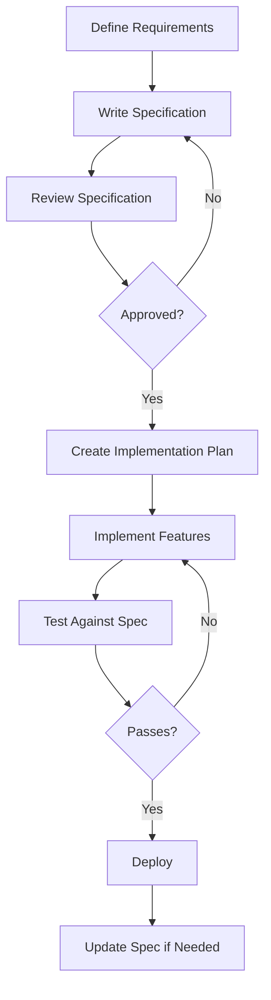

# StormCom Specifications

This directory contains specification documents following the **Spec-Driven Development** methodology using GitHub Spec Kit.

## Directory Structure

```
specifications/
├── README.md                  # This file
├── speckit/                   # Spec Kit example files
│   ├── example_constitution.md    # Constitution template v1
│   └── example_constitution_v2.md # Constitution template v2 (updated)
└── stormcom-platform/         # StormCom platform specifications
    ├── example_spec.md        # Feature specification template (comprehensive)
    └── example_plan.md        # Implementation plan template (comprehensive)
```

## About These Specifications

### StormCom Platform Specifications (`stormcom-platform/`)

These files serve as **comprehensive templates and examples** for writing feature specifications:

- **[example_spec.md](stormcom-platform/example_spec.md)** - A complete feature specification template showing:
  - Executive summary and platform overview
  - System architecture and technology stack
  - Detailed requirements (functional and non-functional)
  - User stories with acceptance criteria
  - Database schema design
  - API contracts and endpoints
  - Security requirements
  - Performance metrics

- **[example_plan.md](stormcom-platform/example_plan.md)** - A complete implementation plan template showing:
  - Technical context and dependencies
  - Performance goals and constraints
  - Development environment setup
  - Implementation phases and milestones
  - Testing strategy
  - Deployment plan
  - Risk mitigation

### Spec Kit Examples (`speckit/`)

Reference constitution templates from GitHub Spec Kit:

- **[example_constitution.md](speckit/example_constitution.md)** - Original constitution template
- **[example_constitution_v2.md](speckit/example_constitution_v2.md)** - Updated constitution template with additional sections

**Note**: The actual project constitution is located at [.specify/memory/constitution.md](../../.specify/memory/constitution.md)

## How to Use These Templates

### Creating a New Feature Specification

When you need to create a specification for a new feature:

1. **Create a new directory** for your feature:
   ```bash
   mkdir -p docs/specifications/your-feature-name
   cd docs/specifications/your-feature-name
   ```

2. **Copy the templates**:
   ```bash
   # Copy the spec template
   cp ../stormcom-platform/example_spec.md ./spec.md
   
   # Copy the plan template
   cp ../stormcom-platform/example_plan.md ./plan.md
   ```

3. **Customize the templates**:
   - Update the feature name and metadata
   - Replace placeholder content with your feature details
   - Keep the structure but adapt the content
   - Remove sections that don't apply to your feature
   - Add sections specific to your feature

4. **Additional specification files** (optional):
   ```bash
   # Create data model specification
   touch data-model.md
   
   # Create API contracts specification
   touch api-contracts.md
   ```

### Example Directory Structure for New Features

```
specifications/
├── your-feature-name/
│   ├── spec.md           # Feature specification
│   ├── plan.md           # Implementation plan
│   ├── data-model.md     # Database schema (optional)
│   └── api-contracts.md  # API documentation (optional)
```

## Specification Best Practices

### 1. Be Specific and Detailed

- Use concrete examples
- Define acceptance criteria clearly
- Include diagrams and schemas
- Specify technical requirements precisely

### 2. Follow the Template Structure

The templates provide a proven structure:
- Executive summary for quick understanding
- Requirements section for what needs to be built
- Technical design for how to build it
- Implementation plan for when and how

### 3. Keep Specifications Updated

- Update specs when requirements change
- Document decisions and rationale
- Track status and progress
- Link to related documents

### 4. Use Consistent Terminology

- Follow the project constitution
- Use the same terms across all specifications
- Define domain-specific terms
- Reference the glossary in the constitution

## Related Documentation

- **Project Constitution**: [.specify/memory/constitution.md](../../.specify/memory/constitution.md) - Project standards and conventions
- **Complete SRS**: [docs/analysis/ecommerce_complete_srs.md](../analysis/ecommerce_complete_srs.md) - Comprehensive requirements from demo analysis
- **Copilot Instructions**: [.github/copilot-instructions.md](../../.github/copilot-instructions.md) - GitHub Copilot configuration
- **Spec Kit Setup**: [docs/SPEC_KIT_SETUP.md](../SPEC_KIT_SETUP.md) - How to install Spec Kit CLI
- **Spec Kit Usage**: [docs/SPEC_KIT_USAGE.md](../SPEC_KIT_USAGE.md) - How to use Spec Kit in StormCom

## Spec-Driven Development Workflow



## Questions?

- **Spec Kit documentation**: See [docs/SPEC_KIT_SETUP.md](../SPEC_KIT_SETUP.md)
- **GitHub Spec Kit**: https://github.com/github/spec-kit
- **Contributing**: See [.github/CONTRIBUTING.md](../../.github/CONTRIBUTING.md)

---

*Last Updated: 2025-10-17*
