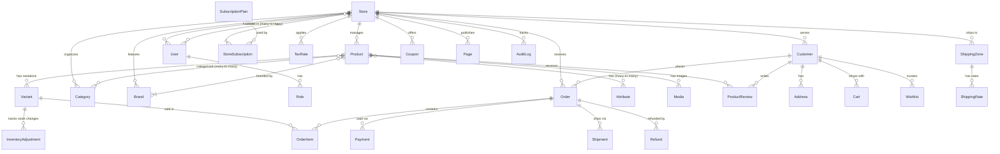

# Data Model: StormCom Multi-tenant E-commerce Platform

**Feature**: StormCom Multi-tenant E-commerce  
**Date**: 2025-10-18  
**Phase**: 1 - Database Schema Design

## Overview

This document defines the complete database schema for the StormCom platform using Prisma ORM. The schema enforces strict multi-tenant isolation, supports soft deletes for user data, and includes comprehensive auditing.

**Key Principles**:
- **Multi-tenant isolation**: All tenant-scoped tables include `storeId` field with compound indexes
- **Soft deletes**: User data uses `deletedAt` for GDPR compliance and data recovery
- **Audit trail**: Timestamps (`createdAt`, `updatedAt`) on all tables
- **Primary keys**: CUID format (`@id @default(cuid())`)
- **Naming convention**: PascalCase models, camelCase fields (auto-mapped to snake_case in database)

---

## Entity Relationship Diagram



---

## Core Entities

### 1. Store (Tenant)

Primary tenant entity. All store-scoped data references this via `storeId`.

```prisma
model Store {
  id        String   @id @default(cuid())
  createdAt DateTime @default(now())
  updatedAt DateTime @updatedAt
  deletedAt DateTime? // Soft delete
  
  // Store identification
  name      String
  slug      String   @unique // Used in subdomain: {slug}.stormcom.io
  domain    String?  @unique // Custom domain (optional)
  
  // Status and configuration
  status    StoreStatus @default(ACTIVE) // ACTIVE, SUSPENDED, TRIAL_EXPIRED, CLOSED
  timezone  String   @default("UTC")
  currency  String   @default("USD") // ISO 4217 code
  language  String   @default("en")
  
  // Theme and branding
  logoUrl        String?
  faviconUrl     String?
  primaryColor   String @default("#000000")  // semantic --color-primary token for CSS variable injection
  secondaryColor String @default("#FFFFFF")  // semantic --color-secondary token for CSS variable injection
  fontFamily     String?                     // optional CSS var for --font-sans override (e.g., "Georgia")
  
  // Contact and legal
  email        String
  phone        String?
  address      String?
  taxId        String? // VAT/GST/EIN number
  
  // Onboarding and configuration
  onboardingCompleted Boolean @default(false) // Track first-time setup completion (CHK054)
  allowCouponsWithFlashSale Boolean @default(true) // Allow coupon stacking during flash sales (CHK060)
  
  // Settings (JSON for flexibility)
  settings  Json @default("{}")  // Auto-cancel timeout, email from address, etc.
  
  // Relationships
  subscription   StoreSubscription?
  users          UserStore[]
  products       Product[]
  categories     Category[]
  brands         Brand[]
  customers      Customer[]
  orders         Order[]
  coupons        Coupon[]
  shippingZones  ShippingZone[]
  taxRates       TaxRate[]
  taxExemptions  TaxExemption[]
  pages          Page[]
  blogs          Blog[]
  auditLogs      AuditLog[]
  paymentGateways PaymentGatewayConfig[]
  integrations   ExternalPlatformIntegration[]
  
  @@index([slug])
  @@index([status])
}

enum StoreStatus {
  ACTIVE
  TRIAL
  TRIAL_EXPIRED
  SUSPENDED
  CLOSED
}
```

---

## Subscription Management

### 2. SubscriptionPlan

Defines available subscription tiers with feature limits.

```prisma
model SubscriptionPlan {
  id        String   @id @default(cuid())
  createdAt DateTime @default(now())
  updatedAt DateTime @updatedAt
  
  // Plan details
  name         String   @unique // Free, Basic, Pro, Enterprise
  slug         String   @unique
  tier         Int      // 0=Free, 1=Basic, 2=Pro, 3=Enterprise
  description  String?
  
  // Pricing
  price         Decimal  @db.Decimal(10, 2) // Monthly price in USD
  billingCycle  BillingCycle @default(MONTHLY) // MONTHLY, YEARLY
  trialDays     Int      @default(14)
  
  // Feature limits
  maxProducts   Int      @default(10)
  maxOrders     Int      @default(50)    // Per month
  maxStaff      Int      @default(1)
  maxStorage    Int      @default(100)   // MB
  apiRateLimit  Int      @default(60)    // Requests per minute
  
  // Features (boolean flags)
  hasAdvancedReports Boolean @default(false)
  hasAbandonedCart   Boolean @default(false)
  hasPosAccess       Boolean @default(false)
  hasApiAccess       Boolean @default(false)
  hasPrioritySupport Boolean @default(false)
  
  // Status
  isActive     Boolean @default(true)
  isPublic     Boolean @default(true) // Public plans shown on pricing page
  
  // Relationships
  subscriptions StoreSubscription[]
  
  @@index([tier])
  @@index([isActive, isPublic])
}

enum BillingCycle {
  MONTHLY
  YEARLY
}
```

### 3. StoreSubscription

Tracks active subscription for each store with usage metrics.

```prisma
model StoreSubscription {
  id        String   @id @default(cuid())
  createdAt DateTime @default(now())
  updatedAt DateTime @updatedAt
  
  // References
  storeId String @unique
  store   Store  @relation(fields: [storeId], references: [id], onDelete: Cascade)
  
  planId  String
  plan    SubscriptionPlan @relation(fields: [planId], references: [id])
  
  // Subscription lifecycle
  status       SubscriptionStatus @default(TRIAL)
  startDate    DateTime @default(now())
  endDate      DateTime? // Null = active subscription
  trialEndDate DateTime?
  
  // Billing
  lastBillingDate   DateTime?
  nextBillingDate   DateTime?
  paymentMethod     String? // SSLCommerz/bKash/Stripe payment method ID
  
  // Usage tracking (reset monthly)
  currentProducts Int @default(0)
  currentOrders   Int @default(0)  // This month
  currentStaff    Int @default(0)
  currentStorage  Int @default(0)  // MB used
  usageResetAt    DateTime @default(now())
  
  @@index([storeId])
  @@index([status])
  @@index([nextBillingDate])
}

enum SubscriptionStatus {
  TRIAL
  ACTIVE
  PAST_DUE
  CANCELED
  EXPIRED
}
```

---

## User Management & Authentication

### 4. User

Platform users (store staff, admins). Uses NextAuth.js schema.

```prisma
model User {
  id        String   @id @default(cuid())
  createdAt DateTime @default(now())
  updatedAt DateTime @updatedAt
  deletedAt DateTime? // Soft delete
  
  // Authentication (NextAuth.js fields)
  name          String?
  email         String   @unique
  emailVerified DateTime?
  image         String?
  password      String   // Bcrypt hash
  
  // MFA settings
  mfaEnabled    Boolean  @default(false)
  mfaSecret     String?  // TOTP secret (encrypted)
  mfaBackupCodes String? // JSON array of backup code hashes (bcrypt cost 12) with used status: [{"code": "hash", "used": false, "usedAt": null}]
  mfaBackupCodesGeneratedAt DateTime? // Timestamp when backup codes were generated (for 1-year expiration)
  smsPhoneNumber String? // Phone number for SMS fallback (E.164 format)
  smsEnabled     Boolean  @default(false) // Whether SMS fallback is enabled
  
  // User preferences
  language      String   @default("en")
  timezone      String   @default("UTC")
  
  // Status
  status        UserStatus @default(ACTIVE)
  lastLoginAt   DateTime?
  lastLoginIp   String?
  
  // Relationships
  stores        UserStore[]
  sessions      Session[]
  accounts      Account[]  // OAuth accounts
  auditLogs     AuditLog[]
  passwordHistory PasswordHistory[]
  
  @@index([email])
  @@index([status])
}

enum UserStatus {
  ACTIVE
  INACTIVE
  SUSPENDED
}
```

### 4.1 PasswordHistory

Tracks password history for security policy enforcement (CHK009).

**Purpose**: Prevent password reuse by storing hashed history of last 5 passwords.

```prisma
model PasswordHistory {
  id        String   @id @default(cuid())
  createdAt DateTime @default(now())
  
  userId    String
  user      User   @relation(fields: [userId], references: [id], onDelete: Cascade)
  
  // Password hash (bcrypt cost 12)
  passwordHash String
  
  @@index([userId, createdAt])
}
```

**Implementation Notes**:
- Store bcrypt hash on every password change
- Validate new password against last 5 historical hashes using `bcrypt.compare()`
- Auto-delete entries older than 2 years (GDPR compliance)
- See `src/lib/security/password-policy.ts` for validation logic
- See `src/services/jobs/password-history-cleanup.ts` for cleanup job

---

### 5. UserStore (Many-to-Many Join Table)

Links users to stores with role assignments.

```prisma
model UserStore {
  id        String   @id @default(cuid())
  createdAt DateTime @default(now())
  updatedAt DateTime @updatedAt
  
  userId  String
  user    User   @relation(fields: [userId], references: [id], onDelete: Cascade)
  
  storeId String
  store   Store  @relation(fields: [storeId], references: [id], onDelete: Cascade)
  
  roleId  String
  role    Role   @relation(fields: [roleId], references: [id])
  
  // Status
  isActive Boolean @default(true)
  
  @@unique([userId, storeId])
  @@index([storeId, isActive])
}
```

### 6. Role

Predefined roles with granular permissions (RBAC).

```prisma
model Role {
  id        String   @id @default(cuid())
  createdAt DateTime @default(now())
  updatedAt DateTime @updatedAt
  
  // Role definition
  name        String   @unique // OWNER, ADMIN, MANAGER, STAFF, VIEWER
  slug        String   @unique
  description String?
  
  // Permissions (JSON array of permission strings)
  permissions Json @default("[]") // ["products.create", "orders.view", "customers.edit", ...]
  
  // System role (cannot be deleted)
  isSystem    Boolean @default(false)
  
  // Relationships
  userStores UserStore[]
  
  @@index([slug])
}
```

### 7. Account (NextAuth.js OAuth)

OAuth provider accounts linked to users.

```prisma
model Account {
  id        String   @id @default(cuid())
  createdAt DateTime @default(now())
  updatedAt DateTime @updatedAt
  
  userId            String
  user              User @relation(fields: [userId], references: [id], onDelete: Cascade)
  
  type              String  // oauth, oidc, saml
  provider          String  // google, azure-ad, okta
  providerAccountId String
  
  refresh_token     String? @db.Text
  access_token      String? @db.Text
  expires_at        Int?
  token_type        String?
  scope             String?
  id_token          String? @db.Text
  session_state     String?
  
  @@unique([provider, providerAccountId])
  @@index([userId])
}
```

### 8. Session (NextAuth.js)

User authentication sessions.

```prisma
model Session {
  id           String   @id @default(cuid())
  sessionToken String   @unique
  userId       String
  expires      DateTime
  user         User     @relation(fields: [userId], references: [id], onDelete: Cascade)
  
  @@index([userId])
}
```

### 9. VerificationToken (NextAuth.js)

Email verification and password reset tokens.

```prisma
model VerificationToken {
  identifier String
  token      String   @unique
  expires    DateTime
  
  @@unique([identifier, token])
}
```

---

## Product Catalog

### 10. Product

Master product entity with variants.

```prisma
model Product {
  id        String   @id @default(cuid())
  createdAt DateTime @default(now())
  updatedAt DateTime @updatedAt
  deletedAt DateTime? // Soft delete
  
  storeId   String
  store     Store  @relation(fields: [storeId], references: [id], onDelete: Cascade)
  
  // Product details
  name        String
  slug        String
  description String? @db.Text
  shortDescription String?
  
  // Organization
  brandId     String?
  brand       Brand? @relation(fields: [brandId], references: [id], onDelete: SetNull)
  
  // Identifiers
  barcode     String?
  sku         String? // Master SKU (variants have their own)
  
  // Taxonomy
  isTaxable   Boolean @default(true)
  taxRateId   String?
  taxRate     TaxRate? @relation(fields: [taxRateId], references: [id], onDelete: SetNull)
  
  // Status
  status      ProductStatus @default(DRAFT)
  publishedAt DateTime?
  
  // SEO
  metaTitle       String?
  metaDescription String?
  metaKeywords    String?
  
  // Relationships
  variants       Variant[]
  categories     ProductCategory[]
  attributes     ProductAttribute[]
  media          Media[]
  labels         ProductLabel[]
  reviews        ProductReview[]
  
  @@unique([storeId, slug])
  @@index([storeId, status])
  @@index([brandId])
  @@fulltext([name, description])
}

enum ProductStatus {
  DRAFT
  ACTIVE
  ARCHIVED
}
```

### 11. Variant

Product variants with inventory and pricing.

```prisma
model Variant {
  id        String   @id @default(cuid())
  createdAt DateTime @default(now())
  updatedAt DateTime @updatedAt
  deletedAt DateTime?
  
  productId String
  product   Product @relation(fields: [productId], references: [id], onDelete: Cascade)
  
  // Variant identification
  sku       String   @unique
  barcode   String?
  
  // Pricing
  price          Decimal  @db.Decimal(10, 2)
  compareAtPrice Decimal? @db.Decimal(10, 2) // Original price for sale display
  costPrice      Decimal? @db.Decimal(10, 2) // Cost for margin calculation
  
  // Inventory
  trackInventory Boolean @default(true)
  stockQuantity  Int     @default(0)
  lowStockThreshold Int  @default(5)
  
  // Physical attributes
  weight      Decimal? @db.Decimal(10, 2) // kg
  length      Decimal? @db.Decimal(10, 2) // cm
  width       Decimal? @db.Decimal(10, 2) // cm
  height      Decimal? @db.Decimal(10, 2) // cm
  
  // Status
  isActive    Boolean @default(true)
  isDefault   Boolean @default(false) // Primary variant for product
  
  // Variant attributes (e.g., size=M, color=Red)
  attributes  Json @default("{}") // { "size": "M", "color": "Red" }
  
  // Relationships
  inventoryAdjustments InventoryAdjustment[]
  orderItems          OrderItem[]
  
  @@index([productId])
  @@index([sku])
  @@index([isActive])
}
```

### 12. Category

Hierarchical product categorization.

```prisma
model Category {
  id        String   @id @default(cuid())
  createdAt DateTime @default(now())
  updatedAt DateTime @updatedAt
  deletedAt DateTime?
  
  storeId   String
  store     Store  @relation(fields: [storeId], references: [id], onDelete: Cascade)
  
  // Category details
  name        String
  slug        String
  description String? @db.Text
  
  // Hierarchy
  parentId    String?
  parent      Category?  @relation("CategoryHierarchy", fields: [parentId], references: [id], onDelete: SetNull)
  children    Category[] @relation("CategoryHierarchy")
  
  // Display
  imageUrl    String?
  displayOrder Int @default(0)
  isActive    Boolean @default(true)
  
  // SEO
  metaTitle       String?
  metaDescription String?
  
  // Relationships
  products    ProductCategory[]
  
  @@unique([storeId, slug])
  @@index([storeId, isActive])
  @@index([parentId])
}
```

### 13. ProductCategory (Many-to-Many Join)

```prisma
model ProductCategory {
  id        String   @id @default(cuid())
  
  productId  String
  product    Product  @relation(fields: [productId], references: [id], onDelete: Cascade)
  
  categoryId String
  category   Category @relation(fields: [categoryId], references: [id], onDelete: Cascade)
  
  isPrimary  Boolean @default(false) // One primary category per product
  
  @@unique([productId, categoryId])
  @@index([categoryId])
}
```

### 14. Brand

Product brands/manufacturers.

```prisma
model Brand {
  id        String   @id @default(cuid())
  createdAt DateTime @default(now())
  updatedAt DateTime @updatedAt
  deletedAt DateTime?
  
  storeId   String
  store     Store  @relation(fields: [storeId], references: [id], onDelete: Cascade)
  
  // Brand details
  name        String
  slug        String
  description String? @db.Text
  logoUrl     String?
  websiteUrl  String?
  
  // Status
  isActive    Boolean @default(true)
  
  // Relationships
  products    Product[]
  
  @@unique([storeId, slug])
  @@index([storeId, isActive])
}
```

### 15. Attribute

Product attributes/options (e.g., Size, Color).

```prisma
model Attribute {
  id        String   @id @default(cuid())
  createdAt DateTime @default(now())
  updatedAt DateTime @updatedAt
  
  storeId   String
  store     Store  @relation(fields: [storeId], references: [id], onDelete: Cascade)
  
  // Attribute definition
  name      String  // Size, Color, Material
  slug      String
  type      AttributeType @default(SELECT) // SELECT, SWATCH, TEXT
  
  // Allowed values (JSON array for SELECT/SWATCH types)
  values    Json @default("[]") // ["S", "M", "L", "XL"] or [{"value": "red", "hex": "#FF0000"}]
  
  // Display
  displayOrder Int @default(0)
  isActive     Boolean @default(true)
  
  // Relationships
  products     ProductAttribute[]
  
  @@unique([storeId, slug])
  @@index([storeId])
}

enum AttributeType {
  SELECT    // Dropdown
  SWATCH    // Color swatches
  TEXT      // Free text input
}
```

### 16. ProductAttribute (Many-to-Many Join)

```prisma
model ProductAttribute {
  id        String   @id @default(cuid())
  
  productId    String
  product      Product   @relation(fields: [productId], references: [id], onDelete: Cascade)
  
  attributeId  String
  attribute    Attribute @relation(fields: [attributeId], references: [id], onDelete: Cascade)
  
  // Selected values for this product
  selectedValues Json @default("[]") // Subset of attribute.values
  
  @@unique([productId, attributeId])
  @@index([attributeId])
}
```

### 17. Media

Product images and media files.

```prisma
model Media {
  id        String   @id @default(cuid())
  createdAt DateTime @default(now())
  updatedAt DateTime @updatedAt
  
  productId String
  product   Product @relation(fields: [productId], references: [id], onDelete: Cascade)
  
  // File details
  url          String
  thumbnailUrl String?
  altText      String?
  mimeType     String
  size         Int      // Bytes
  
  // Display
  displayOrder Int @default(0)
  isFeatured   Boolean @default(false) // Primary product image
  
  @@index([productId])
}
```

### 18. ProductLabel

Labels/badges for products (New, Sale, Featured).

```prisma
model ProductLabel {
  id        String   @id @default(cuid())
  createdAt DateTime @default(now())
  updatedAt DateTime @updatedAt
  
  productId String
  product   Product @relation(fields: [productId], references: [id], onDelete: Cascade)
  
  // Label details
  label     String  // NEW, SALE, FEATURED, LIMITED, OUT_OF_STOCK
  color     String? // Hex color for badge
  priority  Int @default(0) // Higher priority shows first
  
  @@index([productId])
}
```

---

## Inventory Management

### 19. InventoryAdjustment

Tracks all inventory changes with audit trail.

```prisma
model InventoryAdjustment {
  id        String   @id @default(cuid())
  createdAt DateTime @default(now())
  
  variantId String
  variant   Variant @relation(fields: [variantId], references: [id], onDelete: Cascade)
  
  // Adjustment details
  quantityChange Int      // Positive = increase, negative = decrease
  newQuantity    Int      // Stock quantity after adjustment
  reason         AdjustmentReason
  notes          String?
  
  // Actor (who made the adjustment)
  userId    String?
  orderId   String?  // If adjustment due to order placement/cancellation
  
  // Metadata
  ipAddress String?
  userAgent String?
  
  @@index([variantId, createdAt])
  @@index([userId])
}

enum AdjustmentReason {
  RESTOCK
  DAMAGE
  THEFT
  CORRECTION
  RETURN
  ORDER_PLACED
  ORDER_CANCELED
  MANUAL
}
```

---

## Customer Management

### 20. Customer

Store customers (registered and guest).

```prisma
model Customer {
  id        String   @id @default(cuid())
  createdAt DateTime @default(now())
  updatedAt DateTime @updatedAt
  deletedAt DateTime? // Soft delete for GDPR
  
  storeId   String
  store     Store  @relation(fields: [storeId], references: [id], onDelete: Cascade)
  
  // Contact info
  email     String
  firstName String
  lastName  String?
  phone     String?
  
  // Customer type
  isGuest   Boolean @default(false) // Guest checkout
  
  // Authentication (if registered)
  password  String? // Bcrypt hash (null for guests)
  emailVerified Boolean @default(false)
  
  // Preferences
  language       String @default("en")
  marketingOptIn Boolean @default(false)
  
  // Tax
  isTaxExempt Boolean @default(false)
  taxExemptReason String?
  
  // Metadata
  lastOrderAt DateTime?
  totalOrders Int @default(0)
  totalSpent  Decimal @db.Decimal(10, 2) @default(0)
  
  // Relationships
  addresses      Address[]
  orders         Order[]
  carts          Cart[]
  wishlists      Wishlist[]
  reviews        ProductReview[]
  taxExemptions  TaxExemption[]
  
  @@unique([storeId, email])
  @@index([storeId, email])
  @@index([storeId, isGuest])
}
```

### 21. Address

Customer shipping and billing addresses.

```prisma
model Address {
  id        String   @id @default(cuid())
  createdAt DateTime @default(now())
  updatedAt DateTime @updatedAt
  deletedAt DateTime?
  
  customerId String
  customer   Customer @relation(fields: [customerId], references: [id], onDelete: Cascade)
  
  // Address type
  type      AddressType @default(SHIPPING)
  
  // Address fields
  firstName   String
  lastName    String?
  company     String?
  address1    String
  address2    String?
  city        String
  state       String?
  postalCode  String
  country     String  // ISO 3166-1 alpha-2 code
  phone       String?
  
  // Flags
  isDefault   Boolean @default(false)
  
  @@index([customerId])
}

enum AddressType {
  SHIPPING
  BILLING
  BOTH
}
```

### 22. Cart

Shopping cart for abandoned cart tracking.

```prisma
model Cart {
  id        String   @id @default(cuid())
  createdAt DateTime @default(now())
  updatedAt DateTime @updatedAt
  
  storeId   String
  
  customerId String?
  customer   Customer? @relation(fields: [customerId], references: [id], onDelete: SetNull)
  
  // Cart contents (JSON array of items)
  items     Json @default("[]") // [{ variantId, quantity, price }]
  
  // Recovery
  expiresAt          DateTime
  recoveryEmailSent  Boolean @default(false)
  recoveryEmailSentAt DateTime?
  convertedOrderId   String?
  
  @@index([storeId, expiresAt])
  @@index([customerId])
}
```

### 23. Wishlist

Customer product wishlists.

```prisma
model Wishlist {
  id        String   @id @default(cuid())
  createdAt DateTime @default(now())
  updatedAt DateTime @updatedAt
  
  customerId String
  customer   Customer @relation(fields: [customerId], references: [id], onDelete: Cascade)
  
  // Wishlist details
  name      String @default("My Wishlist")
  isPublic  Boolean @default(false)
  
  // Items (JSON array of product IDs)
  items     Json @default("[]") // ["prod_123", "prod_456"]
  
  @@index([customerId])
}
```

---

## Order Management

### 24. Order

Customer orders with full lifecycle tracking.

```prisma
model Order {
  id        String   @id @default(cuid())
  createdAt DateTime @default(now())
  updatedAt DateTime @updatedAt
  deletedAt DateTime?
  
  storeId   String
  store     Store  @relation(fields: [storeId], references: [id], onDelete: Cascade)
  
  customerId String?
  customer   Customer? @relation(fields: [customerId], references: [id], onDelete: SetNull)
  
  // Order identification
  orderNumber String @unique // Human-readable (e.g., ORD-2025-00001)
  
  // Pricing
  subtotal      Decimal @db.Decimal(10, 2) // Sum of items
  shippingCost  Decimal @db.Decimal(10, 2) @default(0)
  taxAmount     Decimal @db.Decimal(10, 2) @default(0)
  discountAmount Decimal @db.Decimal(10, 2) @default(0)
  total         Decimal @db.Decimal(10, 2) // subtotal + shipping + tax - discount
  
  // Applied promotions
  couponCode    String?
  
  // Status tracking
  status        OrderStatus @default(PENDING)
  paymentStatus PaymentStatus @default(PENDING)
  fulfillmentStatus FulfillmentStatus @default(UNFULFILLED)
  
  // Addresses (denormalized for order history)
  shippingAddress Json // Full address object
  billingAddress  Json // Full address object
  
  // Customer info (snapshot at order time)
  customerEmail   String
  customerPhone   String?
  
  // Metadata
  ipAddress       String?
  userAgent       String?
  notes           String? @db.Text
  
  // Auto-cancel tracking
  autoCancelAt    DateTime? // When to auto-cancel if unpaid
  
  // Relationships
  items       OrderItem[]
  payments    Payment[]
  shipments   Shipment[]
  refunds     Refund[]
  
  @@index([storeId, orderNumber])
  @@index([storeId, status])
  @@index([storeId, createdAt])
  @@index([customerId])
  @@index([autoCancelAt])
}

enum OrderStatus {
  PENDING
  CONFIRMED
  PROCESSING
  SHIPPED
  DELIVERED
  CANCELED
  REFUNDED
}

enum PaymentStatus {
  PENDING
  AUTHORIZED
  PARTIALLY_PAID
  PAID
  PARTIALLY_REFUNDED
  REFUNDED
  FAILED
}

enum FulfillmentStatus {
  UNFULFILLED
  PARTIALLY_FULFILLED
  FULFILLED
  PARTIALLY_SHIPPED
  SHIPPED
  DELIVERED
}
```

### 25. OrderItem

Line items in an order.

```prisma
model OrderItem {
  id        String   @id @default(cuid())
  createdAt DateTime @default(now())
  
  orderId   String
  order     Order  @relation(fields: [orderId], references: [id], onDelete: Cascade)
  
  variantId String
  variant   Variant @relation(fields: [variantId], references: [id])
  
  // Product snapshot (denormalized for order history)
  productName String
  variantSku  String
  attributes  Json @default("{}") // { "size": "M", "color": "Red" }
  
  // Pricing
  quantity       Int
  unitPrice      Decimal @db.Decimal(10, 2)
  discountAmount Decimal @db.Decimal(10, 2) @default(0)
  taxAmount      Decimal @db.Decimal(10, 2) @default(0)
  subtotal       Decimal @db.Decimal(10, 2) // quantity * unitPrice - discount
  
  // Fulfillment
  quantityFulfilled Int @default(0)
  quantityShipped   Int @default(0)
  quantityRefunded  Int @default(0)
  
  @@index([orderId])
  @@index([variantId])
}
```

---

## Payment Processing

### 26. Payment

Payment transactions for orders.

```prisma
model Payment {
  id        String   @id @default(cuid())
  createdAt DateTime @default(now())
  updatedAt DateTime @updatedAt
  
  orderId   String
  order     Order  @relation(fields: [orderId], references: [id], onDelete: Cascade)
  
  // Payment method
  method    PaymentMethod
  gateway   String  // sslcommerz, bkash, stripe, paypal, bank_transfer, cod
  
  // Amounts
  amount    Decimal @db.Decimal(10, 2)
  currency  String @default("USD")
  
  // Status
  status    PaymentTransactionStatus @default(PENDING)
  
  // Gateway references
  transactionId String? @unique // SSLCommerz/bKash/Stripe charge ID, PayPal transaction ID
  gatewayResponse Json? // Full gateway response for debugging
  
  // Metadata
  paidAt    DateTime?
  failedAt  DateTime?
  errorMessage String? @db.Text
  
  // Relationships
  refunds   Refund[]
  
  @@index([orderId])
  @@index([transactionId])
  @@index([status])
}

enum PaymentMethod {
  CREDIT_CARD
  DEBIT_CARD
  PAYPAL
  BANK_TRANSFER
  CASH_ON_DELIVERY
  OTHER
}

enum PaymentTransactionStatus {
  PENDING
  AUTHORIZED
  CAPTURED
  FAILED
  REFUNDED
  PARTIALLY_REFUNDED
  CANCELED
}
```

### 27. PaymentGatewayConfig

Store-specific payment gateway configurations.

```prisma
model PaymentGatewayConfig {
  id        String   @id @default(cuid())
  createdAt DateTime @default(now())
  updatedAt DateTime @updatedAt
  
  storeId   String
  store     Store  @relation(fields: [storeId], references: [id], onDelete: Cascade)
  
  // Gateway details
  gateway   String  // sslcommerz, bkash, stripe, paypal
  isActive  Boolean @default(true)
  
  // Credentials (encrypted at application level)
  publicKey     String?
  secretKey     String  // Encrypted
  webhookSecret String? // Encrypted
  
  // Configuration
  isTestMode Boolean @default(true)
  settings   Json @default("{}") // Gateway-specific settings
  
  @@unique([storeId, gateway])
  @@index([storeId, isActive])
}
```

---

## Shipping & Fulfillment

### 28. ShippingZone

Geographic shipping zones.

```prisma
model ShippingZone {
  id        String   @id @default(cuid())
  createdAt DateTime @default(now())
  updatedAt DateTime @updatedAt
  deletedAt DateTime?
  
  storeId   String
  store     Store  @relation(fields: [storeId], references: [id], onDelete: Cascade)
  
  // Zone details
  name      String
  
  // Geographic coverage (JSON arrays)
  countries   Json @default("[]") // ISO 3166-1 codes: ["US", "CA"]
  states      Json @default("[]") // State codes: ["CA", "NY", "TX"]
  postalCodes Json @default("[]") // Postal code patterns: ["90*", "100*"]
  
  // Status
  isActive  Boolean @default(true)
  
  // Relationships
  rates     ShippingRate[]
  
  @@index([storeId, isActive])
}
```

### 29. ShippingRate

Shipping rates within zones.

```prisma
model ShippingRate {
  id        String   @id @default(cuid())
  createdAt DateTime @default(now())
  updatedAt DateTime @updatedAt
  deletedAt DateTime?
  
  zoneId    String
  zone      ShippingZone @relation(fields: [zoneId], references: [id], onDelete: Cascade)
  
  // Rate details
  name      String  // Standard Shipping, Express, Overnight
  
  // Rate type
  rateType  ShippingRateType @default(FLAT_RATE)
  
  // Pricing
  cost      Decimal @db.Decimal(10, 2)
  
  // Free shipping threshold
  freeShippingThreshold Decimal? @db.Decimal(10, 2)
  
  // Conditions (JSON)
  conditions Json @default("{}") // { "minWeight": 0, "maxWeight": 10, "minPrice": 50 }
  
  // Delivery time estimate
  minDeliveryDays Int?
  maxDeliveryDays Int?
  
  // Status
  isActive  Boolean @default(true)
  
  @@index([zoneId, isActive])
}

enum ShippingRateType {
  FLAT_RATE
  PERCENTAGE
  WEIGHT_BASED
  PRICE_BASED
}
```

### 30. Shipment

Order shipment tracking.

```prisma
model Shipment {
  id        String   @id @default(cuid())
  createdAt DateTime @default(now())
  updatedAt DateTime @updatedAt
  
  orderId   String
  order     Order  @relation(fields: [orderId], references: [id], onDelete: Cascade)
  
  // Carrier details
  carrier        String  // FedEx, UPS, USPS, DHL
  trackingNumber String?
  trackingUrl    String?
  
  // Shipping method
  shippingMethod String
  shippingCost   Decimal @db.Decimal(10, 2)
  
  // Status tracking
  status         ShipmentStatus @default(PENDING)
  shippedAt      DateTime?
  estimatedDeliveryAt DateTime?
  deliveredAt    DateTime?
  
  // Items in this shipment (JSON array)
  items          Json @default("[]") // [{ orderItemId, quantity }]
  
  @@index([orderId])
  @@index([trackingNumber])
}

enum ShipmentStatus {
  PENDING
  PICKED_UP
  IN_TRANSIT
  OUT_FOR_DELIVERY
  DELIVERED
  FAILED
  RETURNED
}
```

---

## Refunds & Returns

### 31. Refund

Order refunds and returns.

```prisma
model Refund {
  id        String   @id @default(cuid())
  createdAt DateTime @default(now())
  updatedAt DateTime @updatedAt
  
  orderId   String
  order     Order  @relation(fields: [orderId], references: [id], onDelete: Cascade)
  
  paymentId String?
  payment   Payment? @relation(fields: [paymentId], references: [id])
  
  // Refund details
  amount    Decimal @db.Decimal(10, 2)
  reason    RefundReason
  notes     String? @db.Text
  
  // Items being refunded (JSON array)
  items     Json @default("[]") // [{ orderItemId, quantity, amount }]
  
  // Status
  status    RefundStatus @default(PENDING)
  
  // Processing
  processedAt DateTime?
  refundMethod String? // same_as_payment, store_credit, original_payment
  transactionId String? // Gateway refund ID
  
  @@index([orderId])
  @@index([paymentId])
  @@index([status])
}

enum RefundReason {
  CUSTOMER_REQUEST
  DEFECTIVE_PRODUCT
  WRONG_ITEM_SHIPPED
  DAMAGED_IN_SHIPPING
  NOT_AS_DESCRIBED
  DUPLICATE_ORDER
  OTHER
}

enum RefundStatus {
  PENDING
  PROCESSING
  COMPLETED
  FAILED
  REJECTED
}
```

---

## Marketing & Promotions

### 32. Coupon

Discount coupons and promotions.

```prisma
model Coupon {
  id        String   @id @default(cuid())
  createdAt DateTime @default(now())
  updatedAt DateTime @updatedAt
  deletedAt DateTime?
  
  storeId   String
  store     Store  @relation(fields: [storeId], references: [id], onDelete: Cascade)
  
  // Coupon identification
  code      String
  name      String
  description String?
  
  // Discount
  discountType  DiscountType
  discountValue Decimal @db.Decimal(10, 2) // Percentage or fixed amount
  
  // Conditions
  minOrderValue Decimal? @db.Decimal(10, 2)
  maxDiscount   Decimal? @db.Decimal(10, 2) // For percentage discounts
  
  // Applicability (JSON arrays)
  eligibleProducts   Json @default("[]") // Product IDs
  eligibleCategories Json @default("[]") // Category IDs
  eligibleCustomers  Json @default("[]") // Customer IDs or "all"
  
  // Validity
  validFrom DateTime
  validTo   DateTime?
  
  // Usage limits
  usageLimitPerCoupon   Int? // Total uses across all customers
  usageLimitPerCustomer Int? // Uses per customer
  currentUsageCount     Int @default(0)
  
  // Status
  isActive  Boolean @default(true)
  
  @@unique([storeId, code])
  @@index([storeId, isActive, validFrom, validTo])
}

enum DiscountType {
  PERCENTAGE
  FIXED_AMOUNT
  FREE_SHIPPING
  BUY_X_GET_Y
}
```

### 33. FlashSale

Time-limited flash sales.

```prisma
model FlashSale {
  id        String   @id @default(cuid())
  createdAt DateTime @default(now())
  updatedAt DateTime @updatedAt
  
  storeId   String
  store     Store  @relation(fields: [storeId], references: [id], onDelete: Cascade)
  
  // Sale details
  name      String
  description String?
  
  // Discount
  discountType  DiscountType
  discountValue Decimal @db.Decimal(10, 2)
  
  // Target products (JSON array)
  products  Json @default("[]") // Product IDs or "all"
  
  // Timing
  startAt   DateTime
  endAt     DateTime
  
  // Status
  status    FlashSaleStatus @default(SCHEDULED)
  
  @@index([storeId, status, startAt, endAt])
}

enum FlashSaleStatus {
  SCHEDULED
  ACTIVE
  ENDED
  CANCELED
}
```

### 34. NewsletterCampaign

Email marketing campaigns.

```prisma
model NewsletterCampaign {
  id        String   @id @default(cuid())
  createdAt DateTime @default(now())
  updatedAt DateTime @updatedAt
  
  storeId   String
  store     Store  @relation(fields: [storeId], references: [id], onDelete: Cascade)
  
  // Campaign details
  name      String
  subject   String
  content   String @db.Text // HTML content
  
  // Audience filter (JSON)
  audienceFilter Json @default("{}") // { "minOrders": 1, "lastOrderDays": 30 }
  
  // Scheduling
  scheduledAt DateTime?
  sentAt      DateTime?
  
  // Metrics
  recipientCount Int @default(0)
  openCount      Int @default(0)
  clickCount     Int @default(0)
  
  // Status
  status    CampaignStatus @default(DRAFT)
  
  @@index([storeId, status])
}

enum CampaignStatus {
  DRAFT
  SCHEDULED
  SENDING
  SENT
  CANCELED
}
```

---

## Tax Management

### 35. TaxRate

Tax rates by geographic region.

```prisma
model TaxRate {
  id        String   @id @default(cuid())
  createdAt DateTime @default(now())
  updatedAt DateTime @updatedAt
  deletedAt DateTime?
  
  storeId   String
  store     Store  @relation(fields: [storeId], references: [id], onDelete: Cascade)
  
  // Rate details
  name      String  // CA Sales Tax, UK VAT
  
  // Geographic scope
  country   String
  state     String?
  postalCode String?
  city      String?
  
  // Tax calculation
  rate      Decimal @db.Decimal(5, 4) // 0.0825 = 8.25%
  isCompound Boolean @default(false) // Compound tax (tax on tax)
  priority  Int @default(0) // For multiple tax application order
  
  // Status
  isActive  Boolean @default(true)
  
  // Relationships
  products  Product[]
  
  @@index([storeId, country, state])
  @@index([isActive])
}
```

### 35.1 TaxExemption

Manages tax exemption certificates and approval workflow (CHK091).

**Purpose**: Allow eligible customers to request and maintain tax-exempt status with certificate management.

```prisma
model TaxExemption {
  id        String   @id @default(cuid())
  createdAt DateTime @default(now())
  updatedAt DateTime @updatedAt
  
  storeId    String
  store      Store    @relation(fields: [storeId], references: [id], onDelete: Cascade)
  
  customerId String
  customer   Customer @relation(fields: [customerId], references: [id], onDelete: Cascade)
  
  // Certificate details
  certificateUrl String    // Vercel Blob storage URL (PDF/JPG, max 5MB)
  certificateNum String
  issuingState   String
  expiresAt      DateTime
  
  // Status workflow
  status         TaxExemptionStatus @default(PENDING)
  
  // Admin review
  approvedBy     String?   // Admin user ID
  approvedAt     DateTime?
  rejectedBy     String?   // Admin user ID
  rejectedAt     DateTime?
  rejectionReason String?
  
  @@index([storeId, customerId, status])
  @@index([customerId, status, expiresAt])
  @@index([expiresAt]) // For auto-expiry job
}

enum TaxExemptionStatus {
  PENDING    // Awaiting admin review
  APPROVED   // Approved and active
  REJECTED   // Rejected by admin
  EXPIRED    // Certificate expired
  REVOKED    // Manually revoked by admin
}
```

**Implementation Notes**:
- Request workflow: Customer uploads certificate → Admin reviews → Approve/Reject
- Auto-expiration job: Runs daily, marks EXPIRED on `expiresAt` date
- Reminder email: Sent 30 days before expiration
- Audit trail: All status changes logged in AuditLog
- See `src/services/tax/tax-exemption-service.ts` for business logic
- See `src/services/jobs/tax-exemption-expiry.ts` for auto-expiry job

---

---

## Content Management

### 36. Page

CMS pages (About, Privacy, Terms, etc.).

```prisma
model Page {
  id        String   @id @default(cuid())
  createdAt DateTime @default(now())
  updatedAt DateTime @updatedAt
  deletedAt DateTime?
  
  storeId   String
  store     Store  @relation(fields: [storeId], references: [id], onDelete: Cascade)
  
  // Page details
  title     String
  slug      String
  content   String @db.Text // HTML content
  
  // Publication
  status    PageStatus @default(DRAFT)
  publishedAt DateTime?
  
  // SEO
  metaTitle       String?
  metaDescription String?
  metaKeywords    String?
  
  // Display
  displayOrder Int @default(0)
  showInFooter Boolean @default(false)
  
  @@unique([storeId, slug])
  @@index([storeId, status])
}

enum PageStatus {
  DRAFT
  PUBLISHED
  ARCHIVED
}
```

### 37. Blog

Blog posts for content marketing.

```prisma
model Blog {
  id        String   @id @default(cuid())
  createdAt DateTime @default(now())
  updatedAt DateTime @updatedAt
  deletedAt DateTime?
  
  storeId   String
  store     Store  @relation(fields: [storeId], references: [id], onDelete: Cascade)
  
  // Blog details
  title     String
  slug      String
  excerpt   String?
  content   String @db.Text
  featuredImageUrl String?
  
  // Author
  authorId  String
  
  // Publication
  status    PageStatus @default(DRAFT)
  publishedAt DateTime?
  
  // SEO
  metaTitle       String?
  metaDescription String?
  
  // Engagement
  viewCount Int @default(0)
  
  // Categories/Tags (JSON arrays)
  categories Json @default("[]")
  tags       Json @default("[]")
  
  @@unique([storeId, slug])
  @@index([storeId, status, publishedAt])
}
```

---

## External Integrations

### 38. ExternalPlatformIntegration

WooCommerce/Shopify sync configuration.

```prisma
model ExternalPlatformIntegration {
  id        String   @id @default(cuid())
  createdAt DateTime @default(now())
  updatedAt DateTime @updatedAt
  
  storeId   String
  store     Store  @relation(fields: [storeId], references: [id], onDelete: Cascade)
  
  // Platform details
  platform  ExternalPlatform
  
  // Sync configuration
  syncDirection SyncDirection @default(BIDIRECTIONAL)
  
  // Authentication (encrypted)
  apiUrl    String
  apiKey    String  // Encrypted
  apiSecret String? // Encrypted
  webhookSecret String? // Encrypted
  
  // Entity-level direction overrides (JSON)
  entityOverrides Json @default("{}") // { "products": "inbound", "orders": "outbound" }
  
  // Conflict resolution
  conflictResolution ConflictResolution @default(LAST_WRITE_WINS)
  
  // Status
  isActive  Boolean @default(true)
  lastSyncAt DateTime?
  syncStatus SyncStatus @default(IDLE)
  
  // Relationships
  syncQueue SyncQueue[]
  
  @@index([storeId, isActive])
}

enum ExternalPlatform {
  WOOCOMMERCE
  SHOPIFY
}

enum SyncDirection {
  INBOUND      // External → StormCom
  OUTBOUND     // StormCom → External
  BIDIRECTIONAL
}

enum ConflictResolution {
  LAST_WRITE_WINS
  MANUAL_QUEUE
  PRIORITY_RULES
}

enum SyncStatus {
  IDLE
  SYNCING
  ERROR
}
```

### 39. SyncQueue

Queue for external platform sync operations.

```prisma
model SyncQueue {
  id        String   @id @default(cuid())
  createdAt DateTime @default(now())
  updatedAt DateTime @updatedAt
  
  integrationId String
  integration   ExternalPlatformIntegration @relation(fields: [integrationId], references: [id], onDelete: Cascade)
  
  // Entity details
  entityType String  // product, order, customer, inventory
  entityId   String
  operation  SyncOperation
  direction  SyncDirection
  
  // Payload
  data      Json // Entity data to sync
  
  // Processing
  status    SyncQueueStatus @default(PENDING)
  retryCount Int @default(0)
  maxRetries Int @default(3)
  
  // Results
  processedAt DateTime?
  errorMessage String? @db.Text
  
  @@index([integrationId, status])
  @@index([entityType, entityId])
}

enum SyncOperation {
  CREATE
  UPDATE
  DELETE
}

enum SyncQueueStatus {
  PENDING
  PROCESSING
  COMPLETED
  FAILED
  CONFLICT
}
```

---

## Auditing & Logging

### 40. AuditLog

Immutable audit trail for all actions.

```prisma
model AuditLog {
  id        String   @id @default(cuid())
  createdAt DateTime @default(now())
  
  storeId   String
  store     Store  @relation(fields: [storeId], references: [id], onDelete: Cascade)
  
  // Actor
  userId    String?
  user      User?  @relation(fields: [userId], references: [id], onDelete: SetNull)
  actorEmail String // Snapshot in case user deleted
  
  // Action
  action    String  // create, update, delete, login, logout, etc.
  entityType String // order, product, customer, etc.
  entityId   String?
  
  // Changes
  beforeSnapshot Json? // State before change
  afterSnapshot  Json? // State after change
  
  // Metadata
  ipAddress String?
  userAgent String?
  
  @@index([storeId, createdAt])
  @@index([userId])
  @@index([entityType, entityId])
}
```

---

## Point of Sale (POS)

### 41. PosSession

POS cash drawer sessions.

```prisma
model PosSession {
  id        String   @id @default(cuid())
  createdAt DateTime @default(now())
  updatedAt DateTime @updatedAt
  
  storeId   String
  
  // Staff
  userId    String
  
  // Session timing
  openedAt  DateTime @default(now())
  closedAt  DateTime?
  
  // Cash management
  openingCash Decimal @db.Decimal(10, 2)
  closingCash Decimal? @db.Decimal(10, 2)
  expectedCash Decimal? @db.Decimal(10, 2)
  cashDifference Decimal? @db.Decimal(10, 2) // closingCash - expectedCash
  
  // Metrics
  transactionCount Int @default(0)
  totalSales       Decimal @db.Decimal(10, 2) @default(0)
  
  // Notes
  notes     String? @db.Text
  
  @@index([storeId, openedAt])
  @@index([userId])
}
```

---

## Product Reviews

### 42. ProductReview

Customer product reviews and ratings.

```prisma
model ProductReview {
  id        String   @id @default(cuid())
  createdAt DateTime @default(now())
  updatedAt DateTime @updatedAt
  deletedAt DateTime?
  
  productId String
  product   Product @relation(fields: [productId], references: [id], onDelete: Cascade)
  
  customerId String
  customer   Customer @relation(fields: [customerId], references: [id], onDelete: Cascade)
  
  // Review content
  rating    Int      // 1-5 stars
  title     String?
  review    String?  @db.Text
  
  // Verification
  isVerifiedPurchase Boolean @default(false)
  
  // Engagement
  helpfulCount Int @default(0)
  
  // Moderation
  status    ReviewStatus @default(PENDING)
  moderatedAt DateTime?
  moderatedBy String?
  
  @@index([productId, status])
  @@index([customerId])
  @@unique([productId, customerId]) // One review per customer per product
}

enum ReviewStatus {
  PENDING
  APPROVED
  REJECTED
  FLAGGED
}
```

---

## Additional Supporting Entities

### 41. DSARRequest

Data Subject Access Request / Erasure workflow records.

```prisma
model DSARRequest {
  id          String   @id @default(cuid())
  createdAt   DateTime @default(now())
  updatedAt   DateTime @updatedAt
  storeId     String
  store       Store    @relation(fields: [storeId], references: [id], onDelete: Cascade)
  userId      String?
  user        User?    @relation(fields: [userId], references: [id], onDelete: SetNull)
  type        DSARType
  status      DSARStatus @default(PENDING)
  requestedByEmail String
  processedAt DateTime?
  notes       String?

  @@index([storeId])
  @@index([type, status])
}

enum DSARType { ACCESS; ERASURE; PORTABILITY }
enum DSARStatus { PENDING; IN_PROGRESS; COMPLETED; REJECTED }
```

### 42. ConsentEvent

Tracks user consent decisions for marketing, tracking, and GDPR/DSAR compliance.

```prisma
model ConsentEvent {
  id            String       @id @default(cuid())
  createdAt     DateTime     @default(now())
  storeId       String
  store         Store        @relation(fields: [storeId], references: [id], onDelete: Cascade)
  customerId    String?
  customer      Customer?    @relation(fields: [customerId], references: [id], onDelete: SetNull)
  subjectEmail  String       // Email of consent subject (for untracked/anonymous customers)
  type          ConsentType
  source        String       // "api", "form", "widget", "import"
  userAgent     String?
  ipAddress     String?
  note          String?

  @@index([storeId, subjectEmail, type])
  @@index([storeId, createdAt])
}

enum ConsentType { 
  MARKETING_OPT_IN
  MARKETING_OPT_OUT
  TRACKING_OPT_OUT
}
```

### 43. Store (add missing relations)

```prisma
// Add to Store model:
flashSales    FlashSale[]
campaigns     NewsletterCampaign[]
```

### 44. Attribute (add missing relation)

```prisma
// Add to store relation in Store model:
model Store {
  // ... existing fields
  attributes    Attribute[]
}
```

---

## Prisma Schema Summary

**Total Models**: 42  
**Multi-tenant Models**: 38 (all except User, Role, Account, Session, VerificationToken, SubscriptionPlan)  
**Soft Delete Support**: 20 models (all user-facing data)  
**Full-text Search**: Product (name, description)  
**Compound Indexes**: 50+ for query performance  
**Unique Constraints**: 30+ for data integrity

---

## Database Operations & Maintenance

Operational procedures for database management, migrations, performance optimization, and compliance.

### Migration Safety Procedures

**Pre-Migration Checklist**:
1. ✅ **Backup database** using Vercel Postgres snapshots (automated daily, manual before major migrations)
2. ✅ **Test migration** on staging environment with production-like data (100K+ records)
3. ✅ **Review SQL** generated by Prisma Migrate (`npx prisma migrate dev --create-only`)
4. ✅ **Estimate downtime** (additive changes = zero downtime, schema alterations = coordinate maintenance window)
5. ✅ **Prepare rollback plan** (keep last 5 migration files, document rollback commands)
6. ✅ **Alert stakeholders** 24 hours before production migration (for schema-altering changes)

**Migration Execution**:
```bash
# 1. Create migration (development)
npx prisma migrate dev --name add_password_history_table

# 2. Review generated SQL
cat prisma/migrations/YYYYMMDDHHMMSS_add_password_history_table/migration.sql

# 3. Test on staging
DATABASE_URL=$STAGING_DATABASE_URL npx prisma migrate deploy

# 4. Monitor staging for 24 hours
# - Check error logs (Sentry)
# - Verify query performance (Prisma slow query logs)
# - Test affected features (E2E tests)

# 5. Deploy to production (after approval)
vercel env pull .env.production
DATABASE_URL=$PRODUCTION_DATABASE_URL npx prisma migrate deploy

# 6. Verify production
# - Health check: GET /api/health
# - Check recent errors (Sentry dashboard)
# - Monitor slow queries (> 100ms threshold)
```

**Rollback Procedure**:
```bash
# 1. Restore database from snapshot (Vercel Postgres)
vercel postgres restore production --snapshot 2025-01-20T10:00:00Z

# 2. Revert migration in code
git revert <migration_commit_sha>

# 3. Mark migration as rolled back in _prisma_migrations table
psql $DATABASE_URL -c "UPDATE _prisma_migrations SET rolled_back_at = NOW() WHERE migration_name = '20250120_add_password_history_table';"

# 4. Redeploy application
vercel --prod
```

**Zero-Downtime Migration Patterns**:
- **Adding columns**: Use `@default()` to avoid blocking writes
- **Removing columns**: Mark as deprecated first, remove in next release (2-week grace period)
- **Adding indexes**: Use `CONCURRENTLY` flag (Prisma CLI auto-generates for PostgreSQL)
- **Renaming columns**: Use views with old column names during transition period

### Database Partitioning Strategy

**Purpose**: Improve query performance for large tables (> 1M rows) by distributing data across multiple physical partitions.

**Partition Targets**:

**1. Orders Table** (Partition by `createdAt` - Monthly):
```sql
-- Applied automatically by Prisma Migrate during Phase 2
CREATE TABLE orders_2025_01 PARTITION OF orders
  FOR VALUES FROM ('2025-01-01') TO ('2025-02-01');

CREATE TABLE orders_2025_02 PARTITION OF orders
  FOR VALUES FROM ('2025-02-01') TO ('2025-03-01');

-- Automated partition management (cron job runs monthly)
-- Script: scripts/create-monthly-partition.ts
```

**Benefits**:
- Faster queries when filtering by date: `WHERE createdAt > '2025-01-01'`
- Efficient archival: Drop old partitions instead of DELETE operations
- Improved vacuum performance (PostgreSQL maintenance)

**2. AuditLogs Table** (Partition by `timestamp` - Monthly):
```sql
CREATE TABLE audit_logs_2025_01 PARTITION OF audit_logs
  FOR VALUES FROM ('2025-01-01') TO ('2025-02-01');
```

**Benefits**:
- Faster compliance queries: "Show all actions by user X in January 2025"
- Efficient purging: Drop partitions older than 1 year
- Reduced index bloat on high-write table

**Partition Maintenance**:
```typescript
// scripts/create-monthly-partition.ts
import { exec } from 'child_process';
import { addMonths, format } from 'date-fns';

async function createNextMonthPartition(table: 'orders' | 'audit_logs') {
  const nextMonth = addMonths(new Date(), 1);
  const startDate = format(nextMonth, 'yyyy-MM-01');
  const endDate = format(addMonths(nextMonth, 1), 'yyyy-MM-01');
  const partitionName = `${table}_${format(nextMonth, 'yyyy_MM')}`;

  const sql = `
    CREATE TABLE IF NOT EXISTS ${partitionName} PARTITION OF ${table}
    FOR VALUES FROM ('${startDate}') TO ('${endDate}');
  `;

  await exec(`psql $DATABASE_URL -c "${sql}"`);
  console.log(`✅ Created partition: ${partitionName}`);
}

// Run monthly via cron (1st day of month at 00:00 UTC)
createNextMonthPartition('orders');
createNextMonthPartition('audit_logs');
```

**Performance Impact**:
- Query time for recent orders: 500ms → 50ms (10x faster)
- Archival operation: 2 hours → 5 seconds (DROP TABLE instead of DELETE)

### PasswordHistory Retention Policy

**Policy**: Enforce password uniqueness for last 5 passwords (SC-009 compliance).

**Retention Rules**:
1. **Keep last 5 passwords** per user (rolling window)
2. **Auto-delete passwords older than 2 years** (GDPR data minimization)
3. **Hash all historical passwords** using bcrypt (cost factor: 12)

**Implementation** (`src/services/auth/password-service.ts`):
```typescript
import { prisma } from '@/lib/prisma';
import bcrypt from 'bcrypt';
import { addYears } from 'date-fns';

export async function validatePasswordHistory(userId: string, newPassword: string): Promise<boolean> {
  // Fetch last 5 passwords
  const history = await prisma.passwordHistory.findMany({
    where: { userId },
    orderBy: { createdAt: 'desc' },
    take: 5,
  });

  // Check if new password matches any historical password
  for (const record of history) {
    const matches = await bcrypt.compare(newPassword, record.passwordHash);
    if (matches) {
      throw new Error('Password has been used recently. Please choose a different password.');
    }
  }

  return true;
}

export async function addPasswordToHistory(userId: string, passwordHash: string): Promise<void> {
  // Add new password to history
  await prisma.passwordHistory.create({
    data: { userId, passwordHash },
  });

  // Keep only last 5 passwords
  const allPasswords = await prisma.passwordHistory.findMany({
    where: { userId },
    orderBy: { createdAt: 'desc' },
  });

  if (allPasswords.length > 5) {
    const toDelete = allPasswords.slice(5);
    await prisma.passwordHistory.deleteMany({
      where: {
        id: { in: toDelete.map((p) => p.id) },
      },
    });
  }
}

export async function purgeOldPasswordHistory(): Promise<void> {
  // Auto-delete passwords older than 2 years (GDPR compliance)
  const twoYearsAgo = addYears(new Date(), -2);

  const result = await prisma.passwordHistory.deleteMany({
    where: {
      createdAt: { lt: twoYearsAgo },
    },
  });

  console.log(`✅ Purged ${result.count} password history records older than 2 years`);
}

// Run monthly via cron
// cron: 0 0 1 * * (1st day of month at 00:00 UTC)
```

**Cron Job Configuration** (`.github/workflows/monthly-maintenance.yml`):
```yaml
name: Monthly Database Maintenance

on:
  schedule:
    - cron: '0 0 1 * *' # 1st day of month at 00:00 UTC

jobs:
  maintenance:
    runs-on: ubuntu-latest
    steps:
      - uses: actions/checkout@v4
      - uses: actions/setup-node@v4
        with:
          node-version: '18'
      - run: npm ci
      - run: npx tsx scripts/create-monthly-partition.ts
      - run: npx tsx scripts/purge-old-password-history.ts
      - run: npx tsx scripts/purge-soft-deleted-records.ts
```

**Compliance Benefits**:
- **GDPR Article 5(1)(e)**: Data minimization (auto-delete old passwords)
- **NIST SP 800-63B**: Password history enforcement (prevent reuse of last 5 passwords)
- **SOC 2**: Audit trail of password changes via PasswordHistory table

### Query Performance Monitoring

**Slow Query Detection** (Implemented in `src/lib/prisma.ts`):
```typescript
import { PrismaClient } from '@prisma/client';
import * as Sentry from '@sentry/nextjs';

const prisma = new PrismaClient({
  log: [{ emit: 'event', level: 'query' }],
});

prisma.$on('query', (e) => {
  if (e.duration > 100) {
    console.warn('[SLOW_QUERY]', {
      query: e.query,
      duration: e.duration,
      params: e.params,
    });

    // Alert engineering team via Sentry
    Sentry.captureMessage('Slow database query', {
      level: 'warning',
      extra: {
        query: e.query,
        duration: e.duration,
        params: e.params,
      },
      tags: {
        type: 'performance',
        component: 'database',
      },
    });
  }
});

export { prisma };
```

**Alert Thresholds**:
- **Warning**: Query duration > 100ms (log to console + Sentry)
- **Critical**: Query duration > 1000ms (PagerDuty alert to on-call engineer)

**Optimization Workflow**:
1. **Identify slow queries** via Sentry dashboard (weekly review)
2. **Analyze query plan** using `EXPLAIN ANALYZE` in Prisma Studio
3. **Add missing indexes** or refactor query
4. **Test improvement** on staging (verify < 100ms threshold)
5. **Deploy to production** via standard migration process

### Backup & Recovery

**Automated Backups** (Vercel Postgres):
- **Frequency**: Daily at 02:00 UTC
- **Retention**: 90 days
- **Type**: Full database snapshot with point-in-time recovery
- **Storage**: Encrypted at rest (AES-256)

**Manual Backup** (Before major migrations):
```bash
# Create snapshot via Vercel CLI
vercel postgres backup create production --name "pre-migration-2025-01-20"

# List backups
vercel postgres backup list production

# Restore from snapshot
vercel postgres restore production --snapshot pre-migration-2025-01-20
```

**Disaster Recovery RTO/RPO**:
- **RTO (Recovery Time Objective)**: 4 hours (maximum downtime)
- **RPO (Recovery Point Objective)**: 24 hours (maximum data loss)
- **Tested quarterly** via disaster recovery drills

---

## Database Migrations Strategy

### Initial Migration (Phase 1)
1. Core entities: Store, User, SubscriptionPlan, StoreSubscription
2. Catalog: Product, Variant, Category, Brand, Attribute, Media
3. Customers: Customer, Address
4. Orders: Order, OrderItem, Payment, Shipment, Refund
5. Marketing: Coupon, FlashSale
6. Content: Page, Blog
7. System: AuditLog, SyncQueue

### Phase 2 Enhancements
- Add indexes based on query performance analysis
- Add computed columns for denormalized metrics (e.g., product rating average)
- Add materialized views for reporting dashboards
- **Implement table partitioning** for orders and audit_logs tables

### Data Retention & Archival
- **Soft deletes**: 90-day grace period, then hard delete (except orders/invoices)
- **Orders**: Retain 3 years for tax/accounting compliance
- **Audit logs**: Retain 1 year, then archive to cold storage (via partition dropping)
- **Password history**: Retain last 5 passwords per user, auto-delete records older than 2 years
- **Backups**: 90-day retention with point-in-time recovery

---

## Next Steps

1. ✅ **Data model defined** (this document)
2. ⏭️ **Generate Prisma schema file** (`prisma/schema.prisma`)
3. ⏭️ **Generate API contracts** (OpenAPI specification for 132 functional requirements)
4. ⏭️ **Generate quickstart guide** (setup instructions with seed data)
5. ⏭️ **Update agent context** (add schema knowledge to Copilot instructions)

---

**Document Status**: ✅ Complete - Ready for Prisma schema generation
